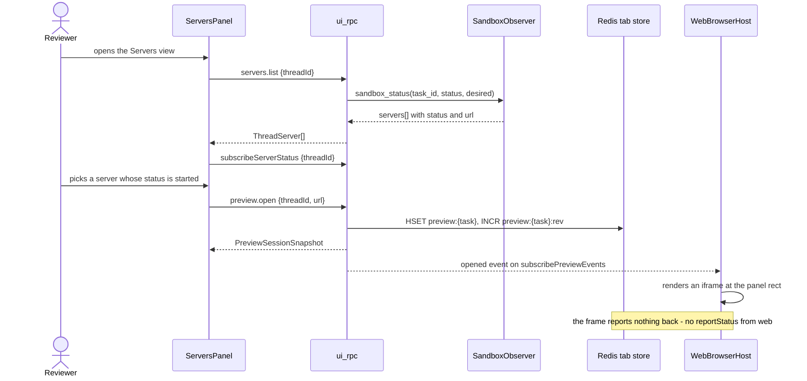

# Preview servers in the T3 Code web app

> **Status:** approved
> **Updated:** 2026-07-31
> **Vocabulary:** `docs/reference/moatless-concept-map.md` for the cross-product terms; Moatless `CONTEXT.md` for sandbox, server and task terms.

Two repositories are cited throughout. Paths beginning `apps/`, `packages/`, `docs/` or `.plans/` are **this repository** (`t3code`). Paths beginning `backend/`, `k8s/` or `crates/` are **Moatless** (`soaplabs/moatless`, read at `3662a76d`). Where a Moatless path is cited it is prefixed `moatless:` so a grep in the wrong checkout does not silently return nothing.

**Two different things are called "preview", and the spec keeps them apart.**

| Word | In Moatless | In T3 Code |
|---|---|---|
| preview / preview server | The declared long-running process serving an app from the sandbox, and the page it serves | — |
| preview / preview tab | — | An in-app browser tab session: `{threadId, tabId, navStatus, canGoBack, canGoForward, viewport}` (`packages/contracts/src/preview.ts:132`) |

Below, **server** always means the Moatless thing and **tab** always means the T3 thing. `preview.*` in code font always means the T3 RPC group.

---

## Current solution

### State slice

- A Moatless task's sandbox runs one container per declared server (`moatless:backend/src/sandbox/CLAUDE.md`, "Pod structure"). Each server has a name, a label, a port and a status.
- Each server port gets a Traefik IngressRoute at `{task_id}--{port}.{proxy_domain}` (`moatless:backend/src/sandbox/k8s/status_resolver.rs:426`).
- The Moatless UI embeds that URL in a sandboxed `<iframe>`.
- T3 Code has a browser panel with tabs, navigation, viewport presets, element picking, screenshots and recordings. Every one of them is rendered by an Electron `<webview>`.
- On the web build the browser panel renders one sentence and nothing else.
- The bridge between the two products is `T3_UI_RPC_ENABLED`, a Moatless-side Rust module that answers T3's RPC contract directly (`moatless:backend/src/ui_rpc/mod.rs`). There is no Node adapter; `.plans/moatless-adapter.md` describes a design that was not built.

### Trace 1 — how Moatless shows a preview server today

| # | Hop | Evidence |
|---|---|---|
| 1 | The status resolver overlays K8s container probe states onto the servers declared in repo config, producing `ServerEntry { name, label, port, status, url, error, detail, default, capabilities }` | `moatless:backend/src/sandbox/schemas.rs:24` |
| 2 | `build_proxy_url` gives each entry `{protocol}://{task_id}--{port}.{proxy_domain}` | `moatless:backend/src/sandbox/k8s/status_resolver.rs:426` |
| 3 | `sandbox_status_handler` authorizes the viewer against the task, resolves desired state, and returns `SandboxStatusFullResponse` with `servers: Vec<ServerEntry>` | `moatless:backend/src/sandbox/handlers.rs:111`, `:116`, `:120`; `moatless:backend/src/sandbox/schemas.rs:140` |
| 4 | The frontend renders the chosen server's `url` in a sandboxed `<iframe>`, with `?path=` and `?device=` search params driving the inner path and the device frame | Moatless frontend preview route |
| 5 | The browser's request to that hostname hits Traefik, which ForwardAuths to `/api/v1/auth/verify` | Traefik middleware, Helm chart |
| 6 | `extract_task_id_from_hostname` splits `{task_id}--{port}` out of the first label and checks the session's access to that task | `moatless:backend/src/auth/routes.rs:820` |
| 7 | The session cookie is scoped to the registrable domain, so the iframe request carries it and the page renders | `moatless:backend/src/auth/routes.rs` cookie construction |

`ServerStatus` is a five-value enum: `Stopped`, `Installing`, `Starting`, `Started`, `Failed` (`moatless:backend/src/sandbox/models.rs:164`).

Per-server logs exist as an SSE endpoint: `GET /api/sandbox/v1/tasks/{task_id}/servers/{server_name}/logs?previous=`, served from `SandboxObserver::server_logs` (`moatless:backend/src/sandbox/handlers.rs:378`, `moatless:backend/src/sandbox/access.rs:35`).

### Trace 2 — how T3 Code shows a browser tab today

| # | Hop | Evidence |
|---|---|---|
| 1 | Something asks for a tab. `addBrowserSurface` calls `openPreviewSession`, then `useRightPanelStore.openBrowser(threadRef, tabId)` | `apps/web/src/components/preview/addBrowserSurface.ts:13` |
| 2 | `preview.open` reaches the server, which creates a session keyed `(threadId, tabId)` in memory, bumps a revision, and publishes an `opened` event | `apps/server/src/preview/Manager.ts` |
| 3 | The right panel gains a `{ id: "browser:<tabId>", kind: "preview", resourceId: tabId }` surface | `apps/web/src/rightPanelStore.ts:22` |
| 4 | `PreviewPanel` runs `isPreviewSupportedInRuntime()` and, on web, returns the desktop-only sentence instead of the view | `apps/web/src/components/preview/PreviewPanel.tsx:19` |
| 5 | On desktop, `PreviewView` renders `PreviewChromeRow` plus a `BrowserSurfaceSlot`, which publishes its `getBoundingClientRect()` into a lease store keyed by runtime tab id | `apps/web/src/components/preview/PreviewView.tsx:607`, `apps/web/src/browser/BrowserSurfaceSlot.tsx:27` |
| 6 | `ElectronBrowserHost`, mounted once at the app root, iterates active sessions and renders one `HostedBrowserWebview` per tab, positioned from that rect | `apps/web/src/AppRoot.tsx:18`, `apps/web/src/browser/ElectronBrowserHost.tsx:16`, `:78` |
| 7 | The webview reports navigation back through `previewBridge`, and `preview.reportStatus` writes it to the server, which fans a `navigated` event to every subscriber | `apps/web/src/components/preview/usePreviewBridge.ts:29` |

Two structural facts fall out of this trace and both matter:

- **The renderer is the only Electron-bound part.** The session model, the lease store, the slot, the right-panel surface and the chrome row are ordinary React and run in a browser today.
- **The host is mounted at the app root, not inside the panel.** That is what lets a tab survive the panel unmounting, and it is why the web renderer must be mounted the same way rather than drawn inside `PreviewView`.

`isPreviewSupportedInRuntime` is a single boolean read of `window.desktopBridge?.preview` (`apps/web/src/previewStateStore.ts:451`), and `previewBridge` is a module-level constant resolved at import (`apps/web/src/components/preview/previewBridge.ts:8`). The boolean has **nine** call sites, not one:

| Call site | What it gates |
|---|---|
| `apps/web/src/components/preview/PreviewPanel.tsx:19` | The whole panel |
| `apps/web/src/components/ChatView.tsx:1524` | Whether an open preview surface counts as open |
| `apps/web/src/components/ChatView.tsx:3068` | The preview toggle |
| `apps/web/src/components/ChatView.tsx:6064`, `:6091` | `browserAvailable` on the right-panel tab strip, inline and sheet |
| `apps/web/src/routes/_chat.tsx:116` | The `preview.toggle` keybinding, which raises a "Preview is desktop-only" toast |
| `apps/web/src/components/ChatMarkdown.tsx:1440`, `:1500` | Open-in-preview on links in chat |
| `apps/web/src/components/files/FilePreviewPanel.tsx:706` | Preview a workspace file in the browser |
| `apps/web/src/browser/openFileInPreview.ts:65` | The same, as a command, returning `BrowserPreviewUnavailableError` |
| `apps/web/src/components/preview/openTerminalLinkInPreview.ts:49` | Opening a URL printed in a terminal |

Which commands the client actually sends is narrower than the contract:

| Method | Called by the client today |
|---|---|
| `preview.open` | Yes — seven call sites |
| `preview.close` | Yes — `apps/web/src/components/ChatView.tsx:1182` |
| `preview.resize` | Yes — `apps/web/src/components/preview/PreviewView.tsx:86` |
| `preview.reportStatus` | Yes — `apps/web/src/components/preview/usePreviewBridge.ts:29` |
| `preview.list` | Yes — `packages/client-runtime/src/state/preview.ts:34` |
| `subscribePreviewEvents` | Yes — `packages/client-runtime/src/state/preview.ts:39` |
| **`preview.navigate`** | **No.** Navigation goes to the Electron bridge, `apps/web/src/components/preview/PreviewView.tsx:137` |
| **`preview.refresh`** | **No.** Refresh goes to the Electron bridge, `apps/web/src/components/preview/PreviewView.tsx:173` |

`subscribePreviewEvents` takes an empty payload (`packages/contracts/src/rpc.ts:641`) — it is environment-wide, and the client filters by `threadId` itself (`apps/web/src/components/preview/usePreviewSession.ts:52`).

### Trace 3 — "Preview URL" on a project action

This is a distinct feature and it is **not** the same mechanism.

| # | Hop | Evidence |
|---|---|---|
| 1 | The action editor exposes a text field, "Open this URL in the in-app preview when this action runs", plus an auto-open checkbox | `apps/web/src/components/ProjectScriptsControl.tsx:568`, `:585` |
| 2 | Those become `previewUrl` and `autoOpenPreview` on the script contract | `packages/contracts/src/orchestration.ts:202`, `:207`; `packages/contracts/src/t3ProjectFile.ts:44`, `:50` |
| 3 | `getConfiguredPreviewUrls` flattens `previewUrl` off every script into a list of strings | `apps/web/src/components/preview/previewEmptyStateLogic.ts` |
| 4 | That list is passed to `PreviewPanel` as `configuredUrls`, and reaches the **empty state only** | `apps/web/src/components/preview/PreviewView.tsx:669` |
| 5 | `mergeServers` turns each configured URL into a `PreviewableServer` — but only after `parseLocalUrl`, which requires `isLoopbackHost` | `apps/web/src/components/preview/useDiscoveredLocalServers.ts:52`, `packages/shared/src/preview.ts:33` |

So the "Preview URL" field is a **suggestion in the browser panel's empty state**, not a server registry and not a launcher. Two consequences:

- **`autoOpenPreview` is read by nothing.** Its own contract comment says "Ignored without `previewUrl` or on web" (`packages/contracts/src/orchestration.ts:207`), and no consumer implements the non-web half.
- **A non-loopback configured URL is silently dropped.** `parseLocalUrl` returns null for it and `mergeServers` skips the entry with no diagnostic. Every Moatless server URL is non-loopback, so this path could never have surfaced one.

### The seam — what Moatless answers today

`moatless:backend/src/ui_rpc/mod.rs` is a Rust implementation of T3's RPC contract, mounted behind `T3_UI_RPC_ENABLED` (`moatless:backend/src/ui_rpc/mod.rs:158`) and wired in `moatless:backend/src/main.rs:429`. It routes three preview-shaped methods and answers all three with nothing:

| Method | What Moatless returns | Line |
|---|---|---|
| `preview.list` | `{ "sessions": [] }` | `moatless:backend/src/ui_rpc/mod.rs:1027` |
| `subscribePreviewEvents` | An open stream that never emits | `moatless:backend/src/ui_rpc/mod.rs:1145` |
| `subscribeDiscoveredLocalServers` | An open stream that never emits | `moatless:backend/src/ui_rpc/mod.rs:1149` |
| Everything else in the group | `unsupported_exit` | `moatless:backend/src/ui_rpc/mod.rs:1150` |

> [!WARNING]
> **`preview.list`'s stub is not schema-valid.** `PreviewListResult` requires `serverEpoch` and `revision` (`packages/contracts/src/preview.ts:193`), and the stub sends neither. The client decodes the result and silently ignores what it cannot decode, so this reads as "no tabs" rather than as an error. Any implementation must fix the stub, not just extend it.

`UiRpcState` (`moatless:backend/src/ui_rpc/mod.rs:131`) currently holds a config handle, an environment identity, a cookie name, a workspace DAO, a conversation DAO and model defaults. **It has no sandbox observer and no Redis handle.** Both have to be threaded in from `moatless:backend/src/main.rs:429`.

Streams have a working producer mechanism: `start_stream` registers a `StreamState` whose `producer` is an aborted-on-drop `JoinHandle`, and `subscribeShell` is the one method that uses it (`moatless:backend/src/ui_rpc/mod.rs:1096`, `:1236`, `:864`). A log stream and a status stream follow that pattern exactly.

`threadId` is the Moatless task id everywhere in the projection (`moatless:backend/src/ui_rpc/projection.rs:157`, `:324`), so a thread-scoped server list is a task-scoped one.

### Measured facts

| Fact | How it was measured |
|---|---|
| An unauthenticated request to a preview host returns `401` with a JSON body | `curl` against a live preview hostname |
| The preview response carries no `X-Frame-Options` and no frame-ancestors CSP | Response headers on the same request |
| The session cookie is scoped to the registrable domain | Cookie attributes on `/login` |
| The backend runs two replicas | `moatless:k8s/helm/moatless-vibe/values.yaml:193` |
| Redis is optional, not required | `moatless:backend/src/startup.rs:176` gates the publisher on `config.redis.url` being present |

Taken together: a same-registrable-domain iframe pointed at a preview host is authenticated by the browser's own cookie and is not refused by any frame-ancestors header. Nothing else is needed to make the page render.

### Dead and misleading paths

- **`autoOpenPreview` has no consumer.** See Trace 3.
- **Non-loopback configured URLs are dropped without a diagnostic.** See Trace 3.
- **`docs/sandbox-architecture.md` in Moatless describes a preview proxy that strips CSP and `X-Frame-Options`.** That proxy belonged to the retired TypeScript sandbox. The live path is Traefik plus ForwardAuth and strips nothing.
- **The inspector script has no live injection route.** `packages/inspector/src/vite.ts` is a Vite plugin the previewed repository installs itself; `injectScriptIntoHtml` and `getInspectorScript` have no caller outside the package. Nothing in the serving path injects anything.
- **`preview.navigate` and `preview.refresh` are contract methods with no client caller.** They are not dead code — they are the two methods a non-Electron renderer needs.

---

## Planned solution

**New**

- `packages/contracts/src/servers.ts` — the `servers.*` contract group.
- `apps/web/src/components/servers/ServersPanel.tsx` — the Servers right-panel view.
- `apps/web/src/browser/WebBrowserHost.tsx` and `apps/web/src/browser/HostedBrowserFrame.tsx` — the iframe renderer.
- `moatless:backend/src/ui_rpc/servers.rs` — `servers.list`, `subscribeServerStatus`, `servers.subscribeLogs`.
- `moatless:backend/src/ui_rpc/preview.rs` and `moatless:backend/src/ui_rpc/preview_store.rs` — the `preview.*` methods and the Redis-backed tab store.

**Changes materially**

- `apps/web/src/previewStateStore.ts:451` — `isPreviewSupportedInRuntime` becomes a capability read, not a desktop check.
- `apps/web/src/components/preview/PreviewPanel.tsx:19` — the desktop-only sentence becomes a fallback for the no-capability case only.
- `apps/web/src/components/preview/PreviewView.tsx` — chrome-row controls become capability-conditional; refresh and open-in-browser gain non-Electron implementations.
- `apps/web/src/rightPanelStore.ts:17` — `RIGHT_PANEL_KINDS` gains `"servers"`; `RIGHT_PANEL_STORAGE_VERSION` goes 7 → 8.
- `apps/web/src/components/RightPanelTabs.tsx:189`, `:236` — a title and an icon for the new kind.
- `moatless:backend/src/ui_rpc/mod.rs:1027` — the `preview.list` stub is replaced by a schema-valid answer.
- `moatless:backend/src/ui_rpc/mod.rs:131` — `UiRpcState` gains a sandbox observer, a task DAO and a tab store.
- `moatless:backend/src/sandbox/access.rs:35` — `SandboxObserver::server_logs` widens from an axum SSE `Event` stream to a log-line stream.

**Untouched**

- The Electron browser tab, and every capability behind it — element picking, screenshots, recordings, agent control, picture-in-picture, zoom, the device toolbar.
- `apps/server/src/preview/Manager.ts` and the whole T3 reference server. It keeps its in-memory sessions and is not asked to grow a tab store.
- The port scanner and `subscribeDiscoveredLocalServers`. They stay, unchanged, as a secondary source.
- `previewUrl` and `autoOpenPreview` on project actions. Trace 3 is not being fixed here.
- How a task's servers are declared, started, stopped, or configured. Nothing in this change writes to a server.
- Chat, files, diffs, terminals, plans.
- Moatless's own preview UI.

### Problem

Someone reviewing an agent's work in the T3 Code web app cannot look at what the agent built. The task is already serving it, on a URL the backend already publishes and the reviewer's own session already authorizes. Between the two sits `apps/web/src/components/preview/PreviewPanel.tsx:19`, which renders "Preview is only available in the T3 Code desktop app."

The workarounds each cost something specific:

| Workaround | What it costs |
|---|---|
| Open the Moatless UI in another tab | The conversation the page belongs to is in the tab you left |
| Paste the URL into a browser tab | Works, and leaves nothing that says whether the server is up, starting, or failed |
| Read the sandbox status page | Says the server failed, and cannot say why without a third product |

And when nothing renders, no surface in the T3 Code web app can distinguish a stopped sandbox from a failed server from an expired session.

### Behaviour

**Reviewer, on the web app**

- Given a task with declared servers, when I open the Servers view, then I see one row per server with its name, label, port and status.
- Given a server whose status is `started`, when I click it, then a browser tab opens on its URL and the page renders in the right panel.
- Given a server whose status is `starting`, when its container becomes ready, then the row changes to `started` without me reloading or refetching anything.
- Given a server whose status is `failed`, when I expand its row, then I see its log lines streaming in the same view.
- Given a server that has already crashed and restarted, when I ask for previous logs, then I get the crashed instance's output.
- Given an open tab, when I type a URL into the address field and submit, then the frame navigates there and the tab's recorded URL changes.
- Given an open tab, when I press refresh, then the frame reloads.
- Given an open tab, when I press open-in-browser, then the URL opens in a real browser tab.
- Given an open tab, when I reload the T3 Code web app, then the tab is still there, on the same URL.
- Given an open tab, when I open the task on a different device, then the tab is there too.
- Given an open tab, when I close it, then it closes for every client on that task.

**Reviewer, on the desktop app**

- Given any of the above, when I do it on the desktop app, then the behaviour is exactly what it is today. The Servers view is additionally available.

**Reviewer, on the web app, when the page will not embed**

- Given a page that refuses to be framed, when the frame stays blank while the server reports `started`, then the panel offers open-in-browser and says the page did not render in place.

**Agent**

- No new capability. An agent cannot open, navigate, or close a tab through anything added here, and cannot read a page through the web renderer.

### Architecture and key flows

#### Moatless — `moatless:backend/src/ui_rpc/servers.rs` (new)

- **Observed:** the RPC dispatcher answers `subscribeDiscoveredLocalServers` with an empty stream (`moatless:backend/src/ui_rpc/mod.rs:1149`) and has no server-status method at all. The data it would need is already assembled by `SandboxObserver::sandbox_status` (`moatless:backend/src/sandbox/access.rs:21`) and shaped as `ServerEntry` (`moatless:backend/src/sandbox/schemas.rs:24`).
- **Proposed responsibility:** what servers a task declares, what state each is in, and what one of them is printing.
- **Proposed change:** three handlers.
  - `servers.list` — authorize the viewer for read on the task, resolve desired state, call `sandbox_status`, project `servers` into `ThreadServer[]`.
  - `subscribeServerStatus` — a producer task that polls `sandbox_status` and emits a snapshot when the projected list differs from the last one emitted. Registered through `start_stream` with its `JoinHandle` stored on the `StreamState`, exactly as `subscribeShell` does (`moatless:backend/src/ui_rpc/mod.rs:1096`).
  - `servers.subscribeLogs` — a producer task that drives `observer.server_logs(task_id, name, previous)` and emits each line as a chunk.
- **Evidence:** authorization and desired-state reads copy `authorize_task_read` (`moatless:backend/src/sandbox/handlers.rs:699`) and `resolve_desired_state` (`moatless:backend/src/sandbox/handlers.rs:778`). `ui_rpc` cannot call them directly — they are `pub(super)` on `SandboxApiState` — so the same two reads are performed against the task DAO and lifecycle handle threaded into `UiRpcState`.

Polling rather than watching is deliberate and matches what the module already does: the shell feed polls (`moatless:backend/src/ui_rpc/mod.rs:1152` onward, "the poll interval is the window that does the coalescing"). A push path exists — the pod watcher publishes convergence events to Redis Streams — and is not used here, because server-container probe transitions are not what the pod watcher classifies. Poll interval: 2s while any client is subscribed, and the stream is aborted with its socket.

#### Moatless — `SandboxObserver::server_logs` widening

- **Observed:** the trait returns `BoxStream<'static, Result<Event, SandboxError>>` where `Event` is `axum::response::sse::Event` (`moatless:backend/src/sandbox/access.rs:9`, `:40`). Its single consumer wraps it in `Sse::new(stream)` (`moatless:backend/src/sandbox/handlers.rs:386`).
- **Proposed responsibility:** produce log lines. Not SSE frames.
- **Proposed change:** the trait returns `BoxStream<'static, Result<String, SandboxError>>`. `server_logs_handler` maps each line into `Event::default().data(line)` at the HTTP boundary. The RPC producer emits each line as a chunk value.
- **Evidence:** `Event` is write-only — it has no accessor for its data — so re-emitting an SSE `Event` over the RPC socket is not possible without this change. The alternative, having the RPC handler open an HTTP connection to the process's own SSE route, adds a loopback hop and an auth re-check for no gain.

#### Moatless — `moatless:backend/src/ui_rpc/preview.rs` and `preview_store.rs` (new)

- **Observed:** `preview.list` returns `{"sessions": []}` and is not schema-valid; `subscribePreviewEvents` never emits; every other `preview.*` method falls through to `unsupported_exit`.
- **Proposed responsibility:** own the set of open tabs on a task, and tell every connected client when it changes.
- **Proposed change:** implement `preview.open`, `preview.navigate`, `preview.resize`, `preview.refresh`, `preview.close`, `preview.list` and `preview.reportStatus` over a `PreviewTabStore` trait with a Redis implementation and an in-memory one.
- **Evidence:** two replicas (`moatless:k8s/helm/moatless-vibe/values.yaml:193`) rule out an in-process map as the production implementation. Redis is already a dependency (`moatless:backend/Cargo.toml:51`) with a shared `ConnectionManager` config (`moatless:backend/src/events.rs:128`), and is already optional (`moatless:backend/src/startup.rs:176`) — so the in-memory implementation is the Docker/dev fallback, not a test double.

Method semantics, given that a web client can never report navigation:

| Method | Effect |
|---|---|
| `preview.open` | Create a tab. With a `url`, `navStatus` is `Success{url, title: ""}`; without one, `Idle`. Publish `opened`. |
| `preview.navigate` | Set `navStatus` to `Success{url, title: ""}`. Publish `navigated`. |
| `preview.resize` | Set `viewport`. Publish `resized`. |
| `preview.refresh` | No stored state changes and no event is published. Answers success. |
| `preview.close` | Remove the tab, or every tab on the thread when `tabId` is absent. Publish `closed`. |
| `preview.reportStatus` | Write the reported `navStatus`, `canGoBack` and `canGoForward` verbatim. Publish `navigated`. Used by the desktop client only. |
| `preview.list` | Return every tab on the thread, plus `serverEpoch` and `revision`. |

`title: ""` is deliberate: `Title` is an unconstrained bounded string (`packages/contracts/src/preview.ts:15`), and the tab strip already falls back to the URL host when the title is blank (`apps/web/src/components/RightPanelTabs.tsx:207`). Inventing a title would put a value in the contract that nothing measured.

#### T3 — `apps/web/src/browser/WebBrowserHost.tsx` and `HostedBrowserFrame.tsx` (new)

- **Observed:** `ElectronBrowserHost` is mounted once at the app root (`apps/web/src/AppRoot.tsx:18`), reads every active session, and returns `null` when not in Electron (`apps/web/src/browser/ElectronBrowserHost.tsx:78`). `HostedBrowserWebview` positions itself from `resolveBrowserSurfacePanelRect(byTabId, runtimeTabId)` (`apps/web/src/browser/HostedBrowserWebview.tsx:11`, `:60`).
- **Proposed responsibility:** draw one `<iframe>` per open tab into the rectangle the panel publishes, outside Electron.
- **Proposed change:** `WebBrowserHost` is the mirror of `ElectronBrowserHost` — same session iteration, same `previewRuntimeTabId` keying (`apps/web/src/browser/previewRuntimeTabId.ts:8`), rendered when the runtime is web. It renders `HostedBrowserFrame`, a fixed-positioned `<iframe>` driven by the same surface-store rect. It is mounted beside `ElectronBrowserHost` in `apps/web/src/AppRoot.tsx:18`; exactly one of the two ever renders anything.
- **Evidence:** mounting at the root, not inside `PreviewView`, is what keeps the frame alive across panel remounts — the same reason `ElectronBrowserHost` is there. Drawing it inside the slot would reload the page every time the panel collapses.

The frame's attributes are fixed by the security posture, not configurable:

- `sandbox="allow-scripts allow-forms allow-same-origin allow-popups"`. `allow-same-origin` is required for the preview host's session cookie to be sent; the frame is a different origin from the app, so it grants the frame access to its own origin only.
- `referrerpolicy="no-referrer"`.
- No `allow` attribute — no camera, microphone or geolocation delegation.
- `src` is set once per tab; navigation re-keys the element rather than assigning `src`, so no history entries accumulate in the parent.

#### T3 — the runtime capability gate

- **Observed:** `isPreviewSupportedInRuntime()` is `Boolean(window.desktopBridge?.preview)` (`apps/web/src/previewStateStore.ts:451`), read at nine call sites listed under Current solution.
- **Proposed responsibility:** answer two different questions that today share one boolean — "can this runtime show a page at all" and "can this runtime do the things only a webview can do".
- **Proposed change:** `previewStateStore.ts` exports `previewRuntimeCapability(): "webview" | "frame" | "none"`. `isPreviewSupportedInRuntime()` stays, defined as `previewRuntimeCapability() !== "none"`, so the seven call sites that only ask "is there a browser" do not change. Two change:
  - `apps/web/src/browser/openFileInPreview.ts:65` — a workspace file is served as an asset URL on the environment origin, which a frame can show. It moves to the same `!== "none"` test and needs no other change.
  - `apps/web/src/components/preview/openTerminalLinkInPreview.ts:49` — stays gated on `isPreviewableUrl` as well (`packages/shared/src/preview.ts:39`), which requires a loopback host. Against Moatless no URL passes it, so this path stays off. That is correct and is not being changed here.
- **Evidence:** `previewBridge` is resolved at import time (`apps/web/src/components/preview/previewBridge.ts:8`), so the capability is stable for the life of the page and can be a plain function rather than a hook.

#### T3 — `apps/web/src/components/preview/PreviewView.tsx`

- **Observed:** the chrome row receives `onBack`, `onForward`, `onRefresh`, `onOpenInBrowser`, `onCapture`, `onPictureInPicture`, `onPickElement` and `trailingActions` (`apps/web/src/components/preview/PreviewView.tsx:612`–`:654`). Four of them already degrade by being passed `undefined` when `previewBridge` is null. `onBack`, `onForward`, `onRefresh` and `onOpenInBrowser` do not.
- **Proposed responsibility:** decide which controls exist, given the capability.
- **Proposed change:**
  - `onBack` / `onForward` — passed `undefined` when the capability is `frame`. `canGoBack` and `canGoForward` are already permanently false there, so the buttons would be dead.
  - `onRefresh` — a frame implementation that bumps a local reload nonce, which `HostedBrowserFrame` uses as part of its React key.
  - `onOpenInBrowser` — `window.open(url, "_blank", "noopener")` when the capability is `frame`, instead of `localApi.shell.openExternal` (`apps/web/src/components/preview/PreviewView.tsx:243`).
  - `handleSubmitUrl` — calls `preview.navigate` when the capability is `frame`, instead of `previewBridge.navigate` (`apps/web/src/components/preview/PreviewView.tsx:137`).
  - The unreachable overlay (`apps/web/src/components/preview/PreviewView.tsx:690`) is driven by `navStatus._tag === "LoadFailed"`, which a frame never produces. Under the `frame` capability it is instead driven by the server's status for the server whose origin the tab is on.

#### T3 — `apps/web/src/components/servers/ServersPanel.tsx` (new)

- **Observed:** the right panel switches on `RightPanelSurface["kind"]` in three places: the store's kind list (`apps/web/src/rightPanelStore.ts:17`), `surfaceTitle` (`apps/web/src/components/RightPanelTabs.tsx:189`) and `SurfaceIcon` (`apps/web/src/components/RightPanelTabs.tsx:236`), with the body chosen in `apps/web/src/components/ChatView.tsx:5621`.
- **Proposed responsibility:** the list of a task's servers, each one's status, each one's log, and handing a chosen URL to a browser tab.
- **Proposed change:** a singleton surface `{ id: "servers", kind: "servers" }`, added to all four switches. The panel subscribes to `subscribeServerStatus`, seeds from `servers.list`, and expands a row into a log stream on demand. Choosing a row calls `addBrowserSurface` with the server's URL (`apps/web/src/components/preview/addBrowserSurface.ts:13`), which already opens the tab and focuses the browser surface.
- **Evidence:** `RIGHT_PANEL_STORAGE_VERSION` is 7 (`apps/web/src/rightPanelStore.ts:41`) and the persisted state is validated against the kind list, so adding a kind requires a version bump to 8. The existing migration path drops unrecognised surfaces, which is the correct behaviour for a downgrade.

#### Key flow — opening a server's page on the web



#### Other flows, named and not drawn

- **A server changes state while its page is open.** The status stream emits; the Servers view re-renders; the open tab is not touched. A tab is never closed because its server stopped — the frame goes blank and the panel explains it from status.
- **A log stream reconnects after a dropped socket.** The producer is aborted with the socket (`moatless:backend/src/ui_rpc/mod.rs:874`). On reconnect the client re-subscribes and receives only new lines; the gap is not backfilled and the view says so.
- **The tab store is emptied.** `serverEpoch` changes, `usePreviewSession` sees the mismatch and refetches the list wholesale (`apps/web/src/components/preview/usePreviewSession.ts:53`). This is the existing epoch mechanism and needs no new client code.
- **Two clients open a tab at the same moment.** Both succeed; each gets its own `tabId`; both appear on both clients. No coordination is needed because tab identity is generated server-side.

### Data model

One stored entity is added. Everything else on the Servers view is read from the sandbox on demand and persisted nowhere.

#### Logical model — the preview tab

- **Meaning:** one browser tab open on a task, as a fact about the task rather than about a person or a device.
- **Ownership:** the Moatless backend. No client is authoritative; a client holds a cache reconciled against `preview.list`.
- **Identity:** `(task_id, tab_id)`. `tab_id` is generated server-side on `preview.open`.
- **Lifecycle:** created by `preview.open`; mutated by `preview.navigate`, `preview.resize` and `preview.reportStatus`; removed by `preview.close`, by the idle TTL, or when the sandbox is removed.
- **Invariants:** `revision` is strictly monotonic per task and increments on every mutation; a client rejects a `preview.list` whose `revision` is lower than one it has already applied under the same `serverEpoch` (`apps/web/src/previewStateStore.ts:321`).
- **Relationships:** many tabs to one task. A tab references no user.

#### Physical representation — Redis

The key names are constrained by the client contract, which requires a monotonic per-thread `revision` and an epoch that identifies the store's contents.

| Key | Type | What this change does to it |
|---|---|---|
| `preview:{task_id}` | hash, field `tab_id` → JSON snapshot | **New.** Every tab open on a task. |
| `preview:{task_id}:rev` | string, used with `INCR` | **New.** The `revision` sent on `PreviewListResult` and on every `PreviewEvent`. |
| `preview:epoch` | string | **New.** Written once with `SET NX` at startup. Identifies the store's contents, not the process. |
| `preview:events` | pub/sub channel | **New.** Every `PreviewEvent`, fanned to every replica. Not a stream — no replay is wanted, because a client that missed events refetches by epoch. |

| Field on the stored snapshot | Type | What this change does to it |
|---|---|---|
| `threadId` | string | **New.** The Moatless task id, per `moatless:backend/src/ui_rpc/projection.rs:157`. |
| `tabId` | string, ≤128 chars | **New.** A UUID. |
| `navStatus` | tagged union: `Idle` \| `Loading` \| `Success` \| `LoadFailed` | **New.** From a web client only `Idle` and `Success` are ever written, and `Success` records what was commanded. |
| `canGoBack` | boolean | **New.** Always `false` under a web client. |
| `canGoForward` | boolean | **New.** Always `false` under a web client. |
| `viewport` | tagged union: `fill` \| `preset` \| `freeform` | **New.** Optional in the contract; absent means fill. |
| `updatedAt` | ISO 8601 string | **New.** Lets a client keep a newer local snapshot over an older listed one (`apps/web/src/previewStateStore.ts:329`). |

Expiry: `EXPIRE` on `preview:{task_id}` and `preview:{task_id}:rev`, refreshed on every write, with a TTL matching the sandbox idle TTL. Both keys are deleted when `Lifecycle::remove` succeeds for the task. A tab whose task no longer exists is unreachable regardless, because every method authorizes the task first.

Nothing here goes in Postgres. Viewport and navigation state are session-shaped, not record-shaped, and there is no query that would want them joined to anything.

#### Not in the model

- **Servers.** Read from the K8s API through `SandboxObserver` on every call. `StatusResolver` deliberately does not cache (`moatless:backend/src/sandbox/CLAUDE.md`, "K8s API as source of truth"), and adding a cache here would reintroduce exactly the stale reads that design avoids.
- **Log lines.** Streamed from the container and kept nowhere.
- **The right-panel Servers surface.** Client-local, in the existing `localStorage`-persisted right-panel state.

### Interfaces and contracts

#### External contract — the `servers.*` group

New file `packages/contracts/src/servers.ts`, registered in `packages/contracts/src/rpc.ts` alongside the preview RPCs at `:810`. Field names are taken verbatim from `ServerEntry` (`moatless:backend/src/sandbox/schemas.rs:24`) so the Rust projection is a rename-free serialization.

```ts
export const ServerRuntimeStatus = Schema.Literals([
  "stopped", "installing", "starting", "started", "failed",
]);

export const ThreadServer = Schema.Struct({
  name: TrimmedNonEmptyString,
  label: TrimmedNonEmptyString,
  port: Schema.Int.check(Schema.isGreaterThan(0)).check(Schema.isLessThan(65536)),
  status: ServerRuntimeStatus,
  url: Schema.NullOr(TrimmedNonEmptyString),
  error: Schema.NullOr(Schema.String),
  detail: Schema.NullOr(Schema.String),
  default: Schema.Boolean,
});
```

| Method | Payload | Success | Stream |
|---|---|---|---|
| `servers.list` | `{ threadId }` | `{ servers: ThreadServer[], sandboxStatus }` | no |
| `subscribeServerStatus` | `{ threadId }` | `{ threadId, servers: ThreadServer[], observedAt }` | yes |
| `servers.subscribeLogs` | `{ threadId, name, previous?: boolean }` | `{ threadId, name, line }` | yes |

`servers.restart`, `servers.setOverride` and `servers.clearOverride` are specified in `.plans/moatless-convergence.md:301` and are **not** implemented here — see Out of scope.

#### External contract — the `preview.*` group

The seven methods listed under Architecture. **The contract itself does not change**; what changes is that Moatless answers it. Two documentation corrections go with the implementation:

- `packages/contracts/src/preview.ts:1` — the module docstring says "The preview is desktop-only (Chromium `<webview>`)" and "The desktop renderer mediates". Both become false.
- `packages/contracts/src/orchestration.ts:207` — `autoOpenPreview`'s comment says "Ignored without `previewUrl` or on web". It stays accurate and stays as it is; nothing here implements it.

#### Who can do what

| Actor | What they can do | Surface | When it takes effect |
|---|---|---|---|
| A user with read access to a task | List its servers | `servers.list` | On request |
| A user with read access to a task | Watch server status | `subscribeServerStatus` | Pushed, ≤2s after a probe change |
| A user with read access to a task | Read a server's log | `servers.subscribeLogs` | Live, while subscribed |
| A user with read access to a task | Open, navigate, resize and close a tab | `preview.*` | Immediately, on every client on that task |
| The desktop client | Report navigation | `preview.reportStatus` | Immediately, on every client on that task |
| An agent | Nothing new | — | — |

Authorization for every one of them is task read, enforced the way `authorize_task_read` enforces it (`moatless:backend/src/sandbox/handlers.rs:699`): fail closed when there is no identity, then a scoped repository read. There is no separate preview permission, and a tab is not private to whoever opened it — that is a deliberate consequence of Decision 3 and is stated in Behaviour.

#### Promises

- A tab belongs to a task. Closing it closes it for everyone who can read the task.
- Nothing in this change starts, stops, restarts or reconfigures a server.
- The web renderer never reads the framed page. No screenshot, no DOM access, no console capture, no navigation reporting.
- `subscribeServerStatus` emits a full list, never a delta. A subscriber that misses a message loses nothing.

#### Internal interfaces — not promises

These are the implementation boundaries the work is planned against. Changing any of them later needs no spec update.

- `PreviewTabStore` in `moatless:backend/src/ui_rpc/preview_store.rs`, with `RedisPreviewTabStore` and `InMemoryPreviewTabStore`. Two implementations, one of which is the production Docker path — not a test double.
- `previewRuntimeCapability()` in `apps/web/src/previewStateStore.ts`.
- `HostedBrowserFrame`'s props, mirroring `HostedBrowserWebview`'s (`apps/web/src/browser/HostedBrowserWebview.tsx:43`).
- The projection function from `ServerEntry` to the wire shape in `moatless:backend/src/ui_rpc/servers.rs`.

Blast radius of the capability-gate change: the nine call sites tabulated under Current solution. Seven are unchanged by construction, because `isPreviewSupportedInRuntime` keeps its name and its meaning widens.

### Failure, safety and recovery

| Condition | State before | State after | What the caller sees | Retry safe | Recovery |
|---|---|---|---|---|---|
| Sandbox stopped or absent | — | unchanged | `servers.list` returns the config-first list with every server `stopped`; no `url` | yes | Start the sandbox |
| `sandbox_status` errors | — | unchanged | The RPC fails; the panel keeps the last list and marks it stale | yes | Automatic on the next poll |
| Server is `installing` or `starting` | — | unchanged | The row says so; opening it is offered but the frame may be blank | yes | The status stream reports the change |
| Server is `failed` | — | unchanged | The row says failed and offers its log | yes | Read the log; restarting is out of scope |
| Redis unreachable on `preview.open` | no tab | no tab | The RPC fails; the Servers view stays usable | yes | Retry the open |
| Redis unreachable mid-write | tab at revision N | tab at revision N | The RPC fails; no event is published | yes — every write is a whole-snapshot `HSET`, never a read-modify-write | Retry |
| Redis flushed or restarted | tabs exist | no tabs | `serverEpoch` changes; clients refetch and find none | n/a | Reopen the tab |
| Log stream drops | — | unchanged | The stream ends; the client re-subscribes and says lines during the gap were not kept | yes | Automatic |
| The socket closes | streams running | producers aborted | Nothing | n/a | Automatic on reconnect (`moatless:backend/src/ui_rpc/mod.rs:874`) |
| The frame shows the preview host's 401 | — | unchanged | The frame renders the 401 JSON body | n/a | The panel cannot read the frame; it infers this from `started` + a blank frame and offers open-in-browser |
| The page refuses to be framed | — | unchanged | A blank frame | n/a | Same inference, same offer |

Two of these deserve a paragraph.

**The opaque frame.** Neither of the last two rows can be detected. The frame is cross-origin, `iframe.onload` fires for an error page as readily as for a real one, and `onerror` does not fire for a frame-ancestors refusal. So the panel's only signal is time: after a fixed interval with the server reporting `started` and no interaction with the frame, it shows a non-blocking strip offering open-in-browser and saying the page may not render in place. This is a hint, not a diagnosis, and the wording must not claim to know which of the two happened.

**Partial writes.** There are none to compensate for. A tab mutation is one `HSET` of a complete snapshot plus one `INCR`, issued as a pipeline. If the `INCR` lands and the `HSET` does not, the revision has advanced past a state that was never stored, which is harmless: revisions are compared, never counted. If the `HSET` lands and the `INCR` does not, a client can reject a list it should have accepted, and recovers on the next mutation. No compensation, no cleanup.

**What still works while a dependency is down.** With Redis unreachable the Servers view is fully functional — list, status stream and logs all read from the sandbox observer and touch no store. Only opening and closing tabs fails. With the sandbox observer failing, existing tabs keep rendering; the server list goes stale and says so.

**Rollback.** Reverting the T3 side restores the desktop-only sentence and leaves stored tabs unread; they expire on their TTL. Reverting the Moatless side returns `unsupported_exit` for `preview.*`, which the client surfaces as a failed command. There is no schema migration to undo. The one irreversible-looking piece, `RIGHT_PANEL_STORAGE_VERSION` 7 → 8, is not: the store's migration drops surfaces of unknown kinds, so a downgraded client discards its Servers surface and keeps the rest.

### Testing and verification

**Moatless — `cargo test -p moatless-vibe-backend`**

- `ui_rpc::servers` — projecting `ServerEntry` to the wire shape, including a server with no `url` and a server with an `error`.
- `ui_rpc::servers` — the status producer emits on change and not on an unchanged poll.
- `ui_rpc::preview_store` — `InMemoryPreviewTabStore` against the same test body as the Redis one: open, navigate, resize, close, list, revision monotonicity, epoch stability across restarts of the store handle.
- `ui_rpc::preview` — `preview.list` on a task with no tabs returns `serverEpoch` and `revision`, which the current stub does not (`moatless:backend/src/ui_rpc/mod.rs:1027`).
- `ui_rpc::preview` — an unauthorized viewer gets a failure exit for every method in the group.

**Moatless — `task test:integration`**

This is the only tier that builds anything under `backend/tests/` behind `db-tests`; `cargo test -p moatless-vibe-backend` compiles almost none of them and passes green regardless. Any test added under `backend/tests/` must be run through this tier.

- A Redis-backed store round-trip across two `PreviewTabStore` handles, standing in for two replicas.
- `servers.list` against a task whose sandbox has never been provisioned, asserting the config-first list.

**Moatless — `cargo clippy -p moatless-vibe-backend -- -D warnings`**

Required after the `SandboxObserver::server_logs` signature change, which touches every implementation of the trait.

**T3 — `pnpm test`**

- `previewRuntimeCapability` returns `webview`, `frame` and `none` for the three runtime shapes.
- `PreviewView` under the `frame` capability passes `undefined` for `onBack` and `onForward`, and a defined `onRefresh`.
- `PreviewView` under the `frame` capability calls `preview.navigate` on URL submit, and does not touch `previewBridge`.
- `WebBrowserHost` renders one frame per active session and none in Electron; `ElectronBrowserHost` renders none outside Electron (`apps/web/src/browser/ElectronBrowserHost.tsx:78`).
- `HostedBrowserFrame` re-keys on the reload nonce and does not reassign `src`.
- The right-panel store migrates version 7 state to 8 without losing existing surfaces, and drops an unknown kind on downgrade.
- `ServersPanel` renders a row per server, expands one into a log stream, and calls `addBrowserSurface` with the chosen URL.

**T3 — `pnpm type:check`, `pnpm lint`**

Required after the contract addition. Both must be clean.

**Contract seam**

The two products share a schema and no test process. A Rust unit test asserting a hand-written JSON literal is the wrong seam — it asserts what the author believed the schema said. Instead: a fixture file of Moatless's `servers.list` and `preview.list` responses, checked into this repository, decoded by the contract schemas in a T3 test. When Moatless changes its projection the fixture changes with it, in one commit, and the decode test is what fails if the two drift.

**Manual verification — what only a person can judge**

- The page renders at a usable size beside the conversation, and the panel divider works.
- Collapsing and reopening the right panel does not reload the page.
- Switching between two open tabs does not reload either.
- A failed server reads as failed, rather than as an unexplained empty frame.
- The controls that do nothing in a browser are absent, not present-and-disabled.
- The log view is readable at the rate a starting dev server produces output.
- The desktop app is indistinguishable from before.

**Acceptance criteria**

- **Given** a task with a `started` server, **when** a reviewer on the web app opens the Servers view and clicks that server, **then** its page renders in the right panel.
- **Given** an open tab on the web app, **when** the reviewer reloads the browser, **then** the tab is still open on the same URL.
- **Given** an open tab, **when** the same user opens the task on another device, **then** the tab is present there.
- **Given** a server in `starting`, **when** its container becomes ready, **then** the Servers view shows `started` within 2 seconds with no user action.
- **Given** a server in `failed`, **when** the reviewer expands it, **then** log lines from the failed instance appear.
- **Given** the desktop app, **when** any existing browser-tab operation is performed, **then** its behaviour is unchanged.
- **Given** Redis is unreachable, **when** the reviewer opens the Servers view, **then** the list and the logs work and only opening a tab fails.

---

## Decisions

| # | Decision | Chosen | Rejected because |
|---|---|---|---|
| [1](#1-where-the-work-lands) | Where the work lands | Both repositories | T3-only adds a second transport to a client that has one; Moatless-only renders nothing |
| [2](#2-where-the-server-list-comes-from) | Where the server list comes from | A fork-owned, thread-scoped `servers.*` group | `DiscoveredLocalServer` carries no status, so the panel could never say a server failed |
| [3](#3-who-owns-the-open-tab) | Who owns the open tab | Moatless, with sessions in Redis | A client-owned tab costs a fork delta in the session store and cannot follow a user to another device; Postgres would hold viewport state |
| [4](#4-where-the-server-list-lives) | Where the server list lives | Its own right-panel view | The browser panel's empty state hides every server the moment a page is open |
| [5](#5-what-renders-the-page) | What renders the page | The existing browser panel, taught to render outside Electron | A second renderer gives the app two things that display web pages and orphans the tab sessions |
| [6](#6-what-the-panel-knows-about-the-page) | What the panel knows about the page | Nothing — the frame is opaque | The injected script has no live injection path, and reviving it puts a build-plugin requirement on every previewed repository |
| [7](#7-what-the-servers-view-does-beyond-list-and-open) | What the servers view does beyond list and open | Per-server logs over the RPC socket | Status without logs sends the user to another product to find out why a server failed |

### 1. Where the work lands

**Chosen:** both repositories. Moatless implements `preview.*` and adds `servers.*`; T3 Code adds the web renderer, the capability gate and the Servers view.

**Rejected — T3 Code only.** The T3 server (`apps/server/src/preview/Manager.ts`) could hold the tab sessions and the client could fetch server status over Moatless's HTTP API. That gives the client two transports to the same backend — the RPC socket and a bespoke HTTP path — and it puts tab state in a process that, in the Moatless deployment, is not running at all. The whole point of `moatless:backend/src/ui_rpc/` is that the client speaks one protocol to one server.

**Rejected — Moatless only.** Moatless can serve every method perfectly and the web app still shows "Preview is only available in the T3 Code desktop app," because nothing in it can draw a page.

**Cost of the choice:** two repositories, one contract, and a seam neither compiler checks. The fixture test under Testing and verification exists to make that seam fail loudly.

### 2. Where the server list comes from

**Chosen:** a new fork-owned contract group, `servers.*`, thread-scoped, carrying each server's status, label, error and URL — the shape already specified in `.plans/moatless-convergence.md:301`.

**Rejected — reuse `subscribeDiscoveredLocalServers`.** It is the one preview-group method with a genuine Moatless correspondence, and Moatless already routes it. But `DiscoveredLocalServer` is `{host, port, url, processName, pid, terminal}` (`packages/contracts/src/preview.ts:257`) and carries **no status field at all**. A panel built on it could show that a port is listening and could never show that a server failed to start — which is the single most useful thing the Moatless data has and the port scanner does not. Reusing it would mean either extending it, breaking its meaning for the desktop scanner, or shipping a status-blind view.

**Rejected — the existing HTTP status endpoint.** `GET /api/sandbox/v1/tasks/{id}/server/status` returns exactly the right data today. Using it directly is the two-transports problem from Decision 1, and it is a poll with no push, so the "it went `started` while I watched" behaviour would not exist.

**Cost of the choice:** a fork delta in `packages/contracts`, which needs a row in `docs/fork/upstream-merge-policy.md`'s path policy table (`docs/fork/upstream-merge-policy.md:107`). The policy's own rule — "unlisted, but inside a fork-owned concern → decide, then add a row" (`:119`) — makes that mandatory, and the concern row that governs it is "Backend contract — adopt only if Moatless implements it" (`:94`). The port scanner is kept as a secondary source, per `.plans/moatless-convergence.md:322`, so a server an agent starts by hand in a terminal is still visible.

### 3. Who owns the open tab

**Chosen:** Moatless, implementing the `preview.*` methods it already routes, with tabs in Redis.

**Rejected — the client owns the tab.** The web client could keep tabs in its own zustand store and never call `preview.*`. This is the smallest change by a wide margin. It fails on two counts. First, `reconcilePreviewServerSessions` rebuilds the session map from `preview.list` wholesale (`apps/web/src/previewStateStore.ts:317`), so a client-created tab is erased the moment the server reports none — making a client-owned tab a fork delta inside the store, not beside it. Second, a tab that lives in one browser tab's memory does not survive a reload and does not follow a user to another device, which is most of what "the server owns tabs" buys the desktop app today.

**Rejected — Postgres.** The product database is the obvious home for anything durable. But a tab is session-shaped: a viewport, a nav status, a URL, updated on every resize drag. There is no query that wants it joined to a task row, and putting it there would mean a migration, a table, and write amplification on a drag gesture.

**Rejected — in-process memory in the Rust backend.** This is what `apps/server/src/preview/Manager.ts` does and it is correct there, because that server is one process. The Moatless backend runs two replicas (`moatless:k8s/helm/moatless-vibe/values.yaml:193`), and the two would disagree about which tabs exist depending on which one a socket landed on.

**Cost of the choice:** Redis becomes load-bearing for opening a tab, on a deployment where it is currently optional (`moatless:backend/src/startup.rs:176`). The in-memory implementation keeps the Docker/dev path working, and the failure table makes the degraded behaviour explicit: without Redis, everything except opening and closing tabs still works.

### 4. Where the server list lives

**Chosen:** its own right-panel view, beside Files and Diff, reachable whatever else is open.

**Rejected — the browser panel's empty state.** `PreviewEmptyState` already renders a picker over `configuredUrls` and scanner results (`apps/web/src/components/preview/PreviewView.tsx:667`), and extending it is the smallest change. But the empty state is by definition what you see when no page is open — so the moment a reviewer opens a server, every other server disappears, including the one that just failed. The list is not a way to start; it is a thing you consult while looking at a page.

**Rejected — a picker in the chrome row.** `trailingActions` is a ready-made slot (`apps/web/src/components/preview/PreviewView.tsx:641`). A dropdown there stays reachable with a page open, and it can hold a status dot. It cannot hold a log stream, and it makes the servers a property of the browser rather than of the task.

**Cost of the choice:** a new `RightPanelKind`, a storage-version bump from 7 to 8 (`apps/web/src/rightPanelStore.ts:41`), and entries in the two switches in `apps/web/src/components/RightPanelTabs.tsx`. All three are mechanical and all three are covered by tests listed above.

### 5. What renders the page

**Chosen:** the existing browser panel, taught to render outside Electron. Picking a server hands its URL to `addBrowserSurface` (`apps/web/src/components/preview/addBrowserSurface.ts:13`) and a new host component draws an iframe into the rect the panel already publishes.

**Rejected — an iframe inside the Servers view.** The Servers view could render its own frame and never touch the browser panel. This is genuinely simpler and it gives the app two surfaces that display web pages, with two address bars, two viewport models and two sets of behaviour to keep aligned. It also leaves the tab-session model — built, tested and already wired to the right panel — serving the desktop app alone.

**Rejected — a new panel that reuses the session model but not the view.** A middle path: same `preview.*` sessions, a purpose-built web view. It duplicates `PreviewChromeRow` and the empty state to avoid touching four props on an existing component.

**Cost of the choice:** `PreviewView` grows capability branches. Four of its eight chrome-row props already degrade to `undefined` when `previewBridge` is null, so the pattern exists; four more join them.

### 6. What the panel knows about the page

**Chosen:** nothing. The frame is opaque. The address field commands navigation and never reports it. There is no back or forward. Every explanation of an empty frame comes from the server's status.

**Rejected — revive the inspector.** `packages/inspector` has a full postMessage protocol: route changes, console output, load failures, element picking. It would give the web panel most of what the webview gives the desktop panel. It has no live injection route in Moatless — `packages/inspector/src/vite.ts` is a Vite plugin the previewed repository installs itself, and `injectScriptIntoHtml`/`getInspectorScript` have no caller outside the package. Reviving it means either putting a build-plugin requirement on every repository anyone wants to preview, or injecting a script into responses in the serving path, which is the CSP-rewriting proxy that was retired.

**Rejected — infer navigation from `iframe.onload`.** The load event fires cross-origin, so it is available. It fires for an error page too, and carries no URL, so what it can report is "something loaded", which is not a nav status. Writing it into `navStatus` would put a value in the store that means less than the one already there.

**Cost of the choice:** the two failure rows the failure table marks as inferred. A 401 in the frame and a frame-ancestors refusal are indistinguishable from each other and from a slow page, and the panel's hint says so rather than guessing.

### 7. What the servers view does beyond list and open

**Chosen:** per-server logs, streamed over the same RPC socket as everything else.

**Rejected — status only.** A list with statuses and no logs answers "did it start" and not "why didn't it". The reviewer who most needs this view is the one looking at a `failed` server, and status-only sends them to another product at exactly that moment.

**Rejected — the existing SSE endpoint, called directly from the client.** `GET /api/sandbox/v1/tasks/{id}/servers/{name}/logs` exists, works, and is authenticated by the same cookie (`moatless:backend/src/sandbox/handlers.rs:378`). Using it is close to zero backend work. It is a second connection with a second lifecycle, a second reconnect policy and a second auth failure mode, in a client whose entire environment protocol is one socket. **This was the user's explicit constraint on the decision.**

**Rejected — add restart.** `servers.restart` is specified (`.plans/moatless-convergence.md:302`) and re-execs the child without recreating the container, which is a better restart primitive than T3 has. It is a small addition and it does not change the model, so it can land later without reopening anything here. It is a write, and every other thing in this spec is a read.

**Cost of the choice:** `SandboxObserver::server_logs` has to stop returning axum SSE `Event` values, because `Event` is write-only and cannot be re-emitted over a different transport. That widens a trait signature and touches every implementation, and it is the one change in this spec that reaches outside the code the change is about.

---

## Out of scope

- **`servers.restart`, `servers.setOverride`, `servers.clearOverride`.** Specified in `.plans/moatless-convergence.md:301`. Every one is a write; this spec is reads plus tab lifecycle. Decision 7 records that restart can land later without reopening anything.
- **Fixing `autoOpenPreview`.** It has no consumer today (`packages/contracts/src/orchestration.ts:207`) and giving it one is a separate product decision about what an action is allowed to do to the panel.
- **Fixing `mergeServers` dropping non-loopback configured URLs.** A real defect (`apps/web/src/components/preview/useDiscoveredLocalServers.ts:52`), on the empty-state path this change routes around. Worth a ticket of its own.
- **Element picking, screenshots, recordings and agent control on the web.** All require reading the page. Decision 6 rules that out.
- **Back and forward on the web.** Same reason.
- **Retiring the port scanner.** `.plans/moatless-convergence.md:322` keeps it deliberately, so a server an agent starts by hand in a terminal stays visible.
- **A preview gateway for non-private environment hosts.** `apps/web/src/browser/browserTargetResolver.ts:65` throws for these, naming a "planned authenticated preview gateway". Moatless does not need it — its preview hosts are public and cookie-authenticated — and building it is a different problem.
- **Mobile.** `apps/mobile` is not touched. Whether an iframe host makes sense there is its own question.

## Open questions

- **The idle TTL on `preview:{task_id}`.** It should match the sandbox idle TTL so a tab does not outlive the thing it points at, but the sandbox TTL is per-deployment (`ttl_minutes` on the reaper). Whether the store reads that config or takes its own value is unresolved; either works and the second is simpler.
- **The blank-frame hint's delay.** The failure table commits to "a fixed interval with the server reporting `started`". What that interval is has not been measured against a real cold-start dev server, and picking it too low would show the hint on every first load.
- **Whether `subscribeServerStatus` should be thread-scoped or environment-wide.** `subscribePreviewEvents` is environment-wide with an empty payload (`packages/contracts/src/rpc.ts:641`) and the client filters. Server status is specified here as thread-scoped, which is what `.plans/moatless-convergence.md:305` says. The inconsistency is deliberate but not obviously right; a reviewer of the contract may prefer symmetry.
- **The poll interval for server status.** 2s is chosen to make "it went `started` while I watched" feel immediate. Against the K8s API, per subscribed client, that may be more load than it is worth; coalescing subscribers per task is an obvious refinement that has not been specified because it has not been measured.

## Ticket breakdown

None. `/to-tickets` has not run.
