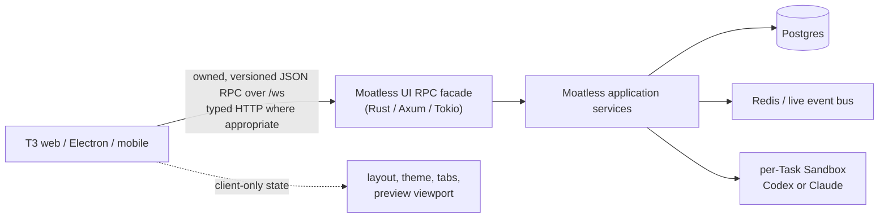
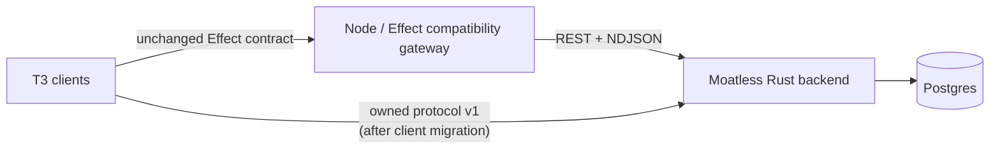

# T3 Code UI on the Moatless backend

For the first runnable browser-to-Rust slice, see
[Local T3 Code + Moatless Rust workflow](./moatless-local-development.md).

## Implementation status: direct Rust phase one

The first direct implementation now lives in the Moatless backend at
`backend/src/ui_rpc/mod.rs`. It is opt-in through `T3_UI_RPC_ENABLED`, reuses the
normal Moatless auth middleware, checks an exact WebSocket Origin allowlist, and
implements the Effect JSON transport plus enough bootstrap RPCs to render a
synchronized empty T3 shell. The local backend is built with
`docker-compose/docker-compose.t3-rpc.yml`; T3's Vite proxy targets it with
`T3CODE_PROXY_TARGET=http://localhost:8080`.

This changes the architecture decision in this document from feasibility-only
to an implemented migration seam. It does not change the functionality matrix:
all Moatless domain projection, live event translation, and commands remain the
next phases. In particular, the existence of `/ws` must not be read as a claim
that all 70 RPC methods are implemented.

Status: architecture and capability audit

Research date: 2026-07-26

T3 Code revision: `5ecc8d5181b2`

Moatless revision: `8ffaeff749c3`

## Executive conclusion

Using T3 Code as the primary UI for Moatless is feasible. If Moatless takes ownership
of both the client contract and its release cadence, implementing the RPC endpoint
directly in the Moatless Rust backend is also feasible and is the better long-term
architecture:



The important qualification is that Rust should implement an **owned wire protocol**,
not attempt to reproduce the Effect library as a Rust framework. The current client
pins `effect@4.0.0-beta.78` and imports `effect/unstable/rpc`. Its actual JSON socket
protocol is small enough to implement and test independently, but it is not a stable
external standard.

There are therefore two valid delivery shapes:



- The Node gateway is the lowest-risk bridge if T3 must remain compatible with
  independently released upstream contracts.
- Direct Rust is the recommended end state if this project owns the T3 fork, freezes
  and versions the protocol, generates both Rust and TypeScript contract artifacts,
  and maintains cross-language conformance fixtures.

Owning only the TypeScript interfaces is insufficient. Ownership must include wire
frames, JSON codecs, streaming/backpressure, cancellation, error envelopes,
authentication, capabilities, snapshot/recovery semantics, compatibility rules, and
golden tests. The detailed feasibility analysis is in
[Direct Rust RPC server feasibility](#direct-rust-rpc-server-feasibility).

This is not only a transport adapter. Several domain assumptions must change:

- A T3 `Project` is a local checkout rooted at one path. A Moatless `Workspace` is a
  reusable multi-repository run composition. They are not interchangeable.
- A T3 `Thread` should be presented as a Moatless `Task`.
- A T3 worktree is not a Moatless Sandbox. The Sandbox materializes a Workspace for one
  Task and is the execution boundary.
- T3's flat message contract loses Moatless tool blocks, tool results, thinking,
  contexts, subagents, external sources, usage, queue state, and result metadata. The
  T3 contract and timeline need a provider-neutral rich-message extension.
- T3 subscriptions assume resumable, monotonic event sequences. Moatless's live NDJSON
  endpoint has no client replay cursor and can skip events when a subscriber lags.
  Snapshot recovery is sufficient for an initial release; durable replay should be
  added to Moatless for a robust production integration.
- Moatless already has much more product surface than T3's RPC exposes: Sandbox
  lifecycle and diagnostics, Workspaces, multi-repository placement, Tasks metadata and
  statistics, Bindings, Loops, Plugins, Skills, Secrets, Teams, users, and integrations.
  These should be added to T3 as native Moatless panels and RPC groups rather than
  squeezed into unrelated T3 concepts.

The existing adapter proves transport portability, but it is currently a read-only
demonstrator. It must not be treated as production-ready.

## Scope and method

This audit covers:

1. every public T3 client/server method: all 70 WebSocket RPC methods, the 20 commands
   inside `orchestration.dispatchCommand`, all 23 typed HTTP endpoints, and the four raw
   HTTP routes;
2. every user-facing T3 product area in web, Electron, and mobile;
3. all 164 operations in the current Moatless OpenAPI document, the non-OpenAPI live
   event/auth/probe routes, the event taxonomy, and the backend-to-Sandbox boundary;
4. the existing T3 `apps/moatless-adapter` implementation and its older
   `.plans/moatless-adapter.md` design;
5. the current Moatless frontend as a behavioral reference for UI features that T3
   does not yet have.

"Every functionality" here means every supported product workflow and every public
client/backend operation. Private helpers, tests, purely visual primitives, and
internal database methods are evidence rather than separate product functions.

The most reliable sources are the executable contracts and current implementations:

- T3: `packages/contracts`, `packages/client-runtime`, `apps/server`, `apps/web`,
  `apps/desktop`, `apps/mobile`, and `apps/moatless-adapter`.
- Moatless: `CONTEXT.md`, `openapi-specs.json`, `crates/api-schemas`, `crates/events`,
  `backend`, `sandbox`, and `apps/frontend`.

Some prose is stale. In particular, Moatless `docs/architecture-overview.md` still
describes an older TypeScript/Hono shape, while the current backend and Sandbox are
Rust. T3 `docs/architecture/providers.md` also understates the current provider-driver
set. This document follows source and generated OpenAPI where they disagree with prose.

## Decision vocabulary

The mapping tables use these dispositions:

| Code       | Meaning                                                                                          |
| ---------- | ------------------------------------------------------------------------------------------------ |
| **Direct** | Moatless already has the same backend primitive. The gateway mainly translates shapes.           |
| **Adapt**  | Moatless can support it by composing current APIs or keeping ephemeral gateway/client state.     |
| **T3+**    | Moatless has the capability, but T3 contracts or UI must be extended.                            |
| **M+**     | T3 exposes a useful capability for which Moatless needs a new backend primitive.                 |
| **Client** | This is a client preference or presentation concern and should not become Moatless domain state. |
| **Hide**   | The local-T3 operation has no useful Moatless meaning and should be capability-gated.            |

These codes describe the target, not what the current adapter implements.

## Direct Rust RPC server feasibility

### Verdict

**Yes, it is technically feasible.** Taking ownership of the whole contract changes
the earlier gateway-only recommendation. The Moatless backend already has the async,
serialization, authentication, application-service, persistence, cancellation, and
event-streaming primitives needed to host the socket. The missing WebSocket protocol
kernel is not large.

It is essential to distinguish four different meanings of "full":

| Meaning                               | Feasibility                     | Assessment                                                                                                                                                                                                   |
| ------------------------------------- | ------------------------------- | ------------------------------------------------------------------------------------------------------------------------------------------------------------------------------------------------------------ |
| Full current wire protocol            | High                            | A bounded Rust state machine can implement every current frame, correlation, stream acknowledgement, interruption, and keepalive rule.                                                                       |
| Full schema surface                   | High, with deliberate tooling   | Generate Rust and TypeScript artifacts from one manifest and test JSON encodings. Hand-maintained duplicate schemas would be unsafe.                                                                         |
| All 70 method names                   | High                            | A Rust registry can dispatch all tags and return a typed capability error for unavailable groups.                                                                                                            |
| Identical behavior for all 70 methods | Not from current Moatless alone | PTYs, T3 worktrees/checkpoints, local editors, arbitrary host browsing, preview automation, relay installation, and several Git workflows require new backend/Sandbox products or should remain unavailable. |

The recommended end state is therefore:

1. own and name a language-neutral protocol, for example
   `moatless-ui-rpc.v1`;
2. retain the current Effect client behind a TypeScript transport adapter during
   migration;
3. implement the protocol state machine and native handlers in Rust;
4. advertise method groups and features explicitly instead of pretending every
   deployment implements all local-T3 behavior;
5. leave the Node adapter available only as a transition/reference implementation.

Protocol v1 can deliberately freeze the current Effect JSON frame shapes. In that
case, the existing Effect client transport can connect to Rust with little or no wire
change; Effect becomes one implementation of the owned specification rather than its
owner. Version/capability fields and generated payload codecs are still controlled by
this project. A later major version may simplify the envelopes or change error
behavior if there is a demonstrated benefit.

If "ownership" instead means copying the current TypeScript types while continuing to
consume arbitrary upstream T3/Effect releases, direct Rust is not recommended. The
Rust server would then be coupled to undocumented changes in a beta, unstable library
without compiler feedback.

### Why the transport is implementable

The current contract contains exactly 70 RPC declarations, of which 14 are streaming.
That does **not** imply 70 different transports. T3 uses one JSON-serialized Effect RPC
protocol over one WebSocket per environment:

- the client creates `RpcClient.makeProtocolSocket`;
- both ends provide `RpcSerialization.layerJson`;
- the server exposes `RpcServer.toHttpEffectWebsocket` at `GET /ws`;
- request ids are `bigint` counters encoded as decimal strings;
- a complete JSON value is carried in each WebSocket frame;
- the JSON decoder also accepts an array of messages in one frame.

The current wire vocabulary is:

| Direction       | Frame       | Required wire fields and meaning                                                                                   |
| --------------- | ----------- | ------------------------------------------------------------------------------------------------------------------ |
| Client → server | `Request`   | `id: string`, `tag: string`, `payload`, `headers: [string,string][]`, and optional `traceId`, `spanId`, `sampled`. |
| Client → server | `Ack`       | `requestId: string`; releases the next batch of a streaming response.                                              |
| Client → server | `Interrupt` | `requestId: string`; cancels that in-flight handler.                                                               |
| Client → server | `Ping`      | Keepalive request.                                                                                                 |
| Client → server | `Eof`       | Ends client input for transports that use it; it is not a substitute for terminal responses.                       |
| Server → client | `Chunk`     | `requestId: string`, `values: [...]`; a non-empty encoded batch for a streaming RPC.                               |
| Server → client | `Exit`      | `requestId: string`, and a terminal success or failure cause.                                                      |
| Server → client | `Defect`    | Connection-level encoded defect. The Effect client fails all in-flight requests.                                   |
| Server → client | `Pong`      | Keepalive response.                                                                                                |

The terminal envelope is:

```ts
type Exit =
  | { _tag: "Success"; value: unknown }
  | {
      _tag: "Failure";
      cause: Array<
        | { _tag: "Fail"; error: unknown }
        | { _tag: "Die"; defect: unknown }
        | { _tag: "Interrupt"; fiberId?: number }
      >;
    };
```

For a stream, `Chunk.values` carries the data and the final successful `Exit.value` is
JSON `null` because Effect's stream exit uses `Schema.Void` and the JSON codec maps
`undefined`/`void` to `null`.

A compatible Rust connection loop needs these invariants:

1. parse a single frame or message array and reject malformed envelopes;
2. preserve request ids as strings, validating decimal syntax without narrowing them
   to JavaScript- or Rust-sized integers;
3. keep one in-flight entry per `(connection, requestId)` and reject duplicates;
4. decode the payload against the method schema before invoking a handler;
5. send exactly one terminal `Exit` for each accepted unary request;
6. for a stream, send a non-empty `Chunk`, then wait for its `Ack` before sending the
   next chunk;
7. cancel the handler task on `Interrupt` and all handler tasks when the socket closes;
8. answer `Ping` promptly—the current client pings every five seconds and times out if
   the previous ping has not received a `Pong` by the next cycle;
9. bound frame size, in-flight calls, stream count, per-stream buffering, and Ack wait
   time;
10. serialize all writes through one bounded connection writer so concurrent handlers
    cannot corrupt frame ordering.

Effect's current client uses a bounded stream queue of 16 elements and sends `Ack`
only after it can offer a received chunk into that queue. Ack handling is therefore a
real memory/backpressure contract, not an optional notification.

`ClientProtocolError` also exists in Effect's encoded server union, but the normal
socket server does not need to emit it. An owned protocol should keep malformed
connection errors separate from request-local validation or unsupported-capability
errors.

### The WebSocket is not the complete T3 environment contract

Implementing all 70 WebSocket methods is not by itself sufficient for an unchanged T3
client. The client/server boundary also contains 23 typed HTTP endpoints and four raw
routes, mapped later in this document. They cover:

- environment discovery;
- browser/bootstrap/token auth and one-use WebSocket tickets;
- orchestration shell/Task snapshots and HTTP dispatch;
- optional T3 Connect/link management;
- the WebSocket upgrade itself, assets, and observability ingestion.

For direct Rust there are two choices:

1. implement the required discovery/auth/snapshot HTTP compatibility routes in Axum
   and capability-gate the optional T3 Connect routes; or
2. update the owned client so discovery/auth stay ordinary HTTP while snapshots and
   dispatch use the new RPC groups.

The second is cleaner long term, but the first gives a smaller initial client diff.
Asset upload/download should continue to use authorized HTTP URLs rather than putting
large binaries into JSON WebSocket frames. Login redirects and OAuth callbacks also
belong on HTTP.

### The schema is larger than the TypeScript types

The current T3 schema surface uses Effect runtime codecs, not TypeScript erasure. A
source scan at the audited revision finds:

- 97 `TaggedErrorClass` declarations;
- 172 uses of non-trivial codec features including transformations, decoding defaults,
  `DateTimeUtc`, `DurationFromMillis`, `Option`, and `Defect`;
- branded, trimmed, bounded, and checked identifiers/numbers;
- both omitted optional keys and explicit nullable fields;
- flexible `Unknown` fields for provider payloads and rich runtime data.

Consequently, matching field names in Rust structs is not enough. For every RPC the
owned contract must define:

| Contract layer | What must be authoritative                                                                           |
| -------------- | ---------------------------------------------------------------------------------------------------- |
| Registry       | Method tag, unary/streaming kind, capability group, stability, version.                              |
| Payload        | JSON representation, required/optional/null rules, defaults, validation, limits.                     |
| Success/chunk  | JSON representation and batching rules.                                                              |
| Declared error | Tagged union and which methods may return each member.                                               |
| Defect         | Safe encoded internal-error representation; never leak Rust errors, SQL, credentials, or stack data. |
| Transport      | Frames, request lifecycle, Ack, cancellation, keepalive, close codes, limits.                        |
| Security       | Authentication method, per-method coarse permission, per-resource authorization.                     |
| Projection     | Snapshot, event order, replay/gap, replacement/deduplication semantics.                              |
| Compatibility  | Major/minor rules, feature negotiation, deprecation, schema digest.                                  |

Effect 4 can derive JSON Schema documents from many Effect schemas, so it can help
bootstrap the manifest and fixtures. It must not be assumed to provide a lossless
round trip for every transformation, default, refinement, declaration, or
`Schema.Unknown`; those semantics need explicit protocol metadata and conformance
examples.

OpenAPI alone is also insufficient. It can own reusable JSON payload components and
the typed HTTP surface, but it does not describe a multiplexed WebSocket state
machine, chunk acknowledgements, cancellation, or stream completion.

### Recommended contract ownership

Put the canonical material in the Moatless repository because the Rust backend is the
server and source of truth. A practical organization is:

```text
protocol/ui-rpc/
  protocol.yaml             # frames, versioning, lifecycle, limits
  methods.yaml              # tags, groups, stream flags, schema refs
  schemas/*.json            # JSON Schema draft 2020-12 components
  fixtures/
    valid/*.json
    invalid/*.json
    conversations/*.jsonl   # complete request/chunk/ack/exit traces
```

Generate or verify:

- Rust `serde` DTOs plus validation and a static method registry;
- TypeScript DTOs and Effect decoders/client declarations;
- a machine-readable capability manifest;
- Markdown method/schema reference;
- schema digests embedded in both client and server builds.

Do not make generated Rust types the implicit schema through implementation details,
and do not keep hand-authored Effect and Rust schemas without a drift gate. If a fully
automatic Effect-schema generator proves impractical, generated TypeScript types plus
small reviewed Effect codec wrappers are acceptable only when golden fixtures are
executed against both implementations in CI.

The existing JSON representation is preferable for version 1:

- it minimizes migration and allows the current client adapter to remain in place;
- it preserves Moatless's flexible rich-message/provider payloads;
- it is easy to capture, diff, fuzz, and diagnose;
- WebSocket framing already supplies message boundaries.

Protobuf is possible, but using `Struct`/opaque JSON for the many open payloads would
remove much of its type advantage while forcing a larger client migration. Connect or
gRPC-Web also does not directly replace the current multiplexed bidirectional
WebSocket/stream model. A future binary codec can be negotiated without changing the
method model.

### Version and capability negotiation

Add protocol information to environment discovery and `server.getConfig`:

```ts
interface UiRpcProtocolDescriptor {
  name: "moatless-ui-rpc";
  major: 1;
  minor: number;
  schemaDigest: string;
  methodGroups: Record<string, { version: number; available: boolean }>;
  features: string[];
  limits: {
    maxFrameBytes: number;
    maxInFlight: number;
    maxStreams: number;
    ackTimeoutMs: number;
  };
}
```

Recommended compatibility rules:

- major mismatch: reject the connection with a clear upgrade error;
- minor additions: optional fields and new capability-gated methods only;
- changing a method tag, field meaning, union discriminator, nullability, default,
  error union, or stream kind requires a new version;
- never send a new enum/union member until the client advertises support;
- keep deprecated methods for at least the supported client overlap window;
- make rolling deployments safe by negotiating once per connection and reconnecting
  on an incompatible server replacement.

`Sec-WebSocket-Protocol: moatless-ui-rpc.v1` is useful once clients support it, but
discovery/config negotiation is still required for method-group versions.

### Rust implementation fit

The current Moatless backend is already a suitable host:

| Need                   | Existing primitive                                    | Required change                                                                                                          |
| ---------------------- | ----------------------------------------------------- | ------------------------------------------------------------------------------------------------------------------------ |
| Async connection/tasks | Tokio with full features                              | Add per-connection supervisor and bounded writer task.                                                                   |
| WebSocket upgrade      | Axum 0.8                                              | Enable Axum's `ws` feature and register the owned route. There is no backend `/ws` implementation today.                 |
| JSON                   | `serde` / `serde_json`                                | Add generated DTOs, strict envelope decoding, and validation.                                                            |
| Cancellation           | `tokio_util::sync::CancellationToken`                 | Use child tokens per request/stream and cancel on interrupt/disconnect.                                                  |
| Concurrency limits     | Tokio channels/semaphores                             | Apply per-identity, per-connection, and per-method limits.                                                               |
| Authentication         | Existing auth middleware and `AuthIdentity`           | Bind the upgraded socket to one identity; optionally implement T3-compatible one-use WS tickets.                         |
| Authorization          | `ScopeContext` and repository/service checks          | Authorize every Task/Workspace resource in the handler; socket authentication alone is never sufficient.                 |
| Live events            | Redis streams → Tokio broadcast in `SseState`         | Share an internal typed live-event port with RPC projections instead of making the backend call its own NDJSON endpoint. |
| Recovery/history       | Postgres `task_events` plus current snapshot APIs     | Add the global durable cursor/gap contract needed by shell-wide resumable streams.                                       |
| Domain operations      | Repositories, lifecycle, DAOs, services, Sandbox gRPC | Call application ports directly, not Axum handlers or loopback REST.                                                     |

A maintainable module boundary would look like:

```text
crates/ui-rpc-protocol/       # generated/owned frames, schemas, registry
backend/src/ui_rpc/
  route.rs                    # upgrade, auth, negotiated descriptor
  connection.rs               # supervisor, inflight map, writer, heartbeat
  dispatch.rs                 # registry and typed handler boundary
  error.rs                    # domain -> declared wire errors
  projection.rs               # snapshots/events/reconciliation
  handlers/
    environment.rs
    conversation.rs
    workspace_files.rs
    sandbox.rs
    preview.rs
    terminal.rs
    vcs.rs
    administration.rs
```

The RPC facade should call the same application services as REST. It must not call
Axum route handlers, construct loopback HTTP requests, or duplicate business rules in
the connection task. Where logic currently exists only inside a handler, extract an
application service/port used by both HTTP and RPC.

For live state, share the authenticated event source internally. The current
`SseState.broadcast` already provides a per-process fan-out receiver, but the RPC layer
also needs:

- structured event values rather than substring filtering serialized JSON;
- per-Task authorization and cache invalidation;
- a bounded per-connection projection queue;
- an explicit lag signal that forces snapshot reconciliation;
- durable replay or snapshot recovery for the global shell view.

Do not hold SQL transactions or locks while waiting for an Ack or a long-running
stream. A handler should commit a mutation, then publish/project its result
asynchronously.

### Direct Rust compared with the gateway

| Criterion                | Node/Effect gateway                        | Rust with current Effect wire clone    | Rust with owned protocol v1                                                                    |
| ------------------------ | ------------------------------------------ | -------------------------------------- | ---------------------------------------------------------------------------------------------- |
| Initial compatibility    | Best; imports T3 contracts directly        | Good only with conformance work        | Good when v1 freezes the current bytes; controlled client changes add negotiation/capabilities |
| Upstream T3 changes      | Compiler exposes most drift                | Hidden until cross-language tests fail | Accepted deliberately through owned versions                                                   |
| Deployment               | Extra process and health boundary          | One backend                            | One backend                                                                                    |
| Request path             | WS → Node → REST → Rust                    | WS → Rust service                      | WS → Rust service                                                                              |
| Auth/authorization       | Credential delegation and two boundaries   | One identity boundary                  | One identity boundary                                                                          |
| Schema duplication       | Low in gateway, translation still required | High if hand-maintained                | Low when generated from one manifest                                                           |
| Event projection         | Node consumes NDJSON                       | Rust can use internal event port       | Rust can use internal event port                                                               |
| Protocol dependency      | Effect owns it                             | Rust tracks Effect internals           | Project owns it                                                                                |
| Long-term recommendation | Migration/fallback                         | Avoid as the permanent model           | **Recommended when both codebases are owned**                                                  |

The middle option—permanently claiming Effect RPC compatibility from Rust while Effect
remains the protocol owner—has the worst maintenance profile. Direct Rust becomes
attractive because ownership lets the project freeze the current behavior, specify
it, correct undesirable behavior in a new version, and change the T3 client in lockstep.

For example, the current Effect implementation may use connection-wide `Defect` for an
unknown tag or fatal defect. The owned protocol should reserve connection failure for
malformed/unsafe transport state and return a request-local typed error for an
unsupported method. That is a protocol change and should be made explicitly, not
accidentally while cloning Effect.

### Feature parity remains the dominant cost

The protocol kernel does not create the product behavior behind the method names. The
70 current methods divide into:

- **native core:** environment probe/config, orchestration snapshots and commands,
  Task/message live state, server lifecycle, auth access;
- **direct application adapters:** Workspace/Task listing, file access, assets,
  current diffs, Sandbox controls, configured servers;
- **new Moatless backend/Sandbox products:** checkpoint/revert, optional PTY,
  placement-aware Git operations, PR preparation, richer pending interactions, durable
  replay;
- **client/local concerns:** preview tab geometry, focus, local editor launch, some
  settings and diagnostics;
- **semantically inappropriate by default:** arbitrary host filesystem browsing,
  nested T3 worktrees inside a Sandbox, UI-triggered deployed-server self-update, and
  relay-client installation.

The Rust registry may expose every method tag for a compatibility window, but absence
must be honest. A method should be:

1. implemented with real Moatless semantics;
2. omitted through negotiated capability groups; or
3. temporarily answered with a declared `UnsupportedCapability` error.

It should not return invented paths/data, silently succeed, or start a stream that
appears live but can never produce a real update. Old T3 clients that eagerly start
every subscription may need quiet compatibility streams during one transition
release; the owned client should stop opening unavailable subscriptions.

Extending the T3 UI for all Moatless resources does not require forcing them into the
legacy 70 methods. Add owned groups for Task/Sandbox controls, Workspaces,
Repositories, Adapters, Bindings, Loops, Plugins/Skills, Secrets, account/API keys,
Teams/users, and administration. These can use the same Rust dispatcher and
transport.

### Security and operational requirements

A production direct server needs all of the following before replacing the gateway:

- cookie, bearer, or single-use ticket authentication on upgrade;
- resource authorization on every request and event—not a socket-wide “all scopes”
  assumption;
- exact Task/Workspace execution targets, never authorization by caller-supplied
  absolute `cwd`;
- request id uniqueness and bounded in-flight maps;
- method-specific payload/frame/chunk/output limits;
- Ack timeout and slow-consumer cancellation;
- heartbeat timeout and deterministic socket cleanup;
- mutation idempotency carried through reconnect/retry;
- structured logging that excludes credentials, prompts, file contents, terminal
  output, and encoded defects by default;
- per-user rate/concurrency controls so many subscriptions cannot exhaust a replica;
- metrics for active sockets/requests/streams, decode failures, unsupported methods,
  Ack latency/timeouts, lag/recovery, cancellation, and handler latency;
- graceful drain on deploy: stop accepting requests, terminate/reconcile streams, and
  make clients reconnect against a negotiated compatible version.

Multi-replica operation also requires that a reconnect to another replica can rebuild
state from Postgres plus the event system. No correctness-critical projection may
exist only in a socket task.

### Conformance strategy

Before writing many handlers, make the protocol executable as tests:

1. capture golden unary success/failure, stream/chunk/Ack/exit, interrupt, malformed
   frame, unknown method, ping/pong, and disconnect traces from the pinned Effect
   client/reference server;
2. run those traces against the Rust parser/state machine;
3. run every valid/invalid schema fixture through both generated TypeScript decoders
   and Rust validators;
4. start the real T3 client against Rust and exercise all 70 method tags, asserting
   either a typed result/stream or a negotiated unsupported capability;
5. fuzz envelope decoding, ids, batching, exits, causes, and connection ordering;
6. property-test that every accepted request reaches exactly one terminal state and
   leaves no task/latch/in-flight entry after exit, cancellation, timeout, or close;
7. keep one compatibility job against the pinned Effect release until the custom
   client transport no longer depends on Effect wire behavior.

Schema digest checks are useful but not sufficient: two codecs can describe similar
JSON Schema and still differ on defaults, unknown properties, transforms, error
ordering, or `null`/omitted behavior. Golden values and full conversations are the
cross-language truth.

### Migration plan for a direct server

1. **Freeze:** pin the T3/Effect revision, capture the current method registry, JSON
   codecs, auth flow, and wire conversations.
2. **Specify:** publish protocol v1, method/capability manifest, limits, shared errors,
   and compatibility rules.
3. **Generate:** introduce Rust/TypeScript artifacts and make drift fail CI.
4. **Kernel:** implement WebSocket/auth/dispatch/unary/stream/Ack/interrupt/ping in
   Rust with synthetic handlers.
5. **Core:** bind server/config and orchestration to Moatless application services and
   the internal event port.
6. **Client switch:** add `backendKind`/protocol negotiation and connect Moatless
   environments directly to Rust while stock T3 environments retain their current
   transport.
7. **Expand:** implement files, rich messages, Sandbox, preview, and new native
   Moatless groups in the priorities below.
8. **Retire the hop:** keep `apps/moatless-adapter` as conformance/reference tooling,
   then remove it from production once direct-Rust acceptance criteria pass.

Indicative engineering size, not a delivery commitment:

| Work                                                 | Relative size | Main uncertainty                                                   |
| ---------------------------------------------------- | ------------- | ------------------------------------------------------------------ |
| Robust protocol kernel and wire conformance          | Small–medium  | Failure/close races, Ack timeouts, compatibility fixtures.         |
| Canonical manifest, generators, and schema migration | Medium        | Effect transformations/defaults and flexible provider values.      |
| Core Task/conversation/live UI path                  | Medium–large  | Projection/recovery and rich messages, not WebSocket mechanics.    |
| All useful T3 local workflows                        | Large         | New Sandbox PTY/Git/checkpoint/preview products.                   |
| All Moatless administration in T3                    | Large         | UI breadth and authorization, largely independent of RPC language. |

The go/no-go rule is simple:

- choose direct Rust when the team owns the T3 fork and contract, accepts a controlled
  client migration, and will fund cross-language conformance;
- keep the Node/Effect gateway when arbitrary upstream T3 clients must work without a
  negotiated compatibility boundary.

## Current system models

### T3 Code

T3 is a local/remote coding-agent shell. Web, Electron, and mobile clients connect to an
execution environment. The core server:

- owns Projects and Threads as an event-sourced read model;
- launches provider drivers for Codex, Claude Agent, Cursor, Grok, and OpenCode;
- operates local files, Git/worktrees, PTYs, previews, browser automation, source
  control, and external editors;
- exposes 70 JSON Effect RPC methods over one WebSocket at `/ws`;
- exposes 23 typed HTTP endpoints for discovery, auth, snapshots, dispatch, and T3
  Connect;
- uses a global monotonic orchestration sequence and snapshot-plus-replay subscriptions.

The relevant T3 entities are:

| T3 entity             | Important fields/behavior                                                                                                                                                  |
| --------------------- | -------------------------------------------------------------------------------------------------------------------------------------------------------------------------- |
| Execution environment | Environment id/label/platform/version/capabilities; one shared connection runtime per saved environment.                                                                   |
| Project               | `id`, title, local `workspaceRoot`, optional repository identity, default model, scripts.                                                                                  |
| Thread                | Project id, model selection, runtime/interaction mode, branch, worktree path, latest Turn, archive/settle/snooze state, messages, activities, plans, checkpoints, Session. |
| Turn                  | Latest lifecycle state: running/interrupted/completed/error and timestamps.                                                                                                |
| Session               | Provider process/session state and active Turn.                                                                                                                            |
| Message               | Flat user/assistant/system role, one text string, optional image attachments.                                                                                              |
| Activity              | Generic timeline record carrying tool/approval/info/error presentation.                                                                                                    |
| Checkpoint            | Git-backed per-Turn changed-file summary and revert target.                                                                                                                |
| Provider instance     | User-configured driver instance, credentials/home/config, models, traits, commands, and update status.                                                                     |

### Moatless

Moatless is a multi-user control plane for coding agents running in on-demand isolated
Sandboxes. The current backend:

- persists Tasks, Turns, Messages, Workspaces, Repositories, credentials, Bindings,
  Loops, Plugins, Skills, and access state;
- launches either the `claude-code` or `codex` Agent harness in a per-Task Sandbox;
- materializes a one- or multi-repository Workspace inside that Sandbox;
- exposes REST/OpenAPI plus a live authenticated NDJSON event stream;
- controls Docker or Kubernetes Sandbox runtimes through an internal gRPC boundary;
- owns tenancy, public/user/global access, authorization, and external Adapter ingress.

The authoritative Moatless vocabulary is:

| Moatless entity                | Important fields/behavior                                                                                                                               |
| ------------------------------ | ------------------------------------------------------------------------------------------------------------------------------------------------------- |
| Repository                     | Git pointer: remote, host, name, default branch. It does not own run configuration.                                                                     |
| Workspace                      | Reusable run composition: zero or more `WorkspaceRepo` placements plus image, setup, env, servers, resources, and network profile.                      |
| WorkspaceRepo                  | Repository placement with branch override, mount name, primary flag, and ordering.                                                                      |
| Task                           | Central conversation/work unit with open/closed/error state, scope, visibility, owner, cost, tags, TTL, relations, Bindings, and Sandbox desired state. |
| Sandbox                        | Exactly one ephemeral isolated runtime per Task. It materializes the Workspace and runs servers and an Agent.                                           |
| Turn                           | Persisted user-message/agent-response lifecycle unit. The Sandbox calls the active invocation a Run.                                                    |
| Session                        | Resumable Agent CLI conversation spanning Turns. Codex calls this a thread only within Codex-specific code.                                             |
| Agent harness                  | Fixed Task-level execution implementation: `claude-code` or `codex`.                                                                                    |
| Agent mode/model               | Per-Turn `plan`/`edit` mode and selected model.                                                                                                         |
| Message                        | Rich content-block envelope with tool results, contexts, usage, source, subagent links, queue/result metadata, and sender.                              |
| Adapter / connection / Binding | Integration type, configured installation, and a live Task-to-external-subject link, respectively.                                                      |
| Loop                           | Recurring Task definition driven by a Schedule or Subscription.                                                                                         |
| Plugin / Skill / Activation    | Registered capability repository, a capability within it, and effective global/personal on/off selection.                                               |

## Canonical terminology and entity mapping

Moatless is the authoritative backend, so Moatless terminology should be used in the UI
whenever the selected environment is Moatless. Do not globally rename local T3 concepts
where their meaning remains different.

| T3 term                 | Moatless term                          | Mapping and required change                                                                                                                                                                                                                               |
| ----------------------- | -------------------------------------- | --------------------------------------------------------------------------------------------------------------------------------------------------------------------------------------------------------------------------------------------------------- |
| Environment             | Deployment / connected environment     | A saved T3 environment represents one Moatless control-plane deployment. It is **not** a Task Sandbox. Add `backendKind: "t3" \| "moatless"` and a stable deployment-derived environment id.                                                              |
| Project                 | Workspace                              | Present "Workspace" in Moatless mode. Populate from `/api/v1/workspaces`, not from Repositories. A T3 Project schema cannot represent multiple repo placements or run config, so add Moatless Workspace resources instead of overloading `workspaceRoot`. |
| Repository identity     | Repository                             | A Workspace has zero-to-many Repository placements. Show repositories as Workspace children with primary/mount/branch metadata.                                                                                                                           |
| `workspaceRoot`         | Execution root (local T3 only)         | It is a host path, not a Moatless Workspace id. Make it optional/legacy for remote backends or introduce a tagged execution target. Never manufacture a path and then use it as authority.                                                                |
| Thread                  | Task                                   | Same user-level unit closely enough to map. All Moatless UI copy should say Task. IDs can remain opaque branded strings on the wire.                                                                                                                      |
| Turn                    | Turn                                   | Direct conceptual match. Moatless's runtime-internal Run is not another T3 entity.                                                                                                                                                                        |
| Session                 | Session                                | Direct at product level. Preserve the provider session id and distinguish from auth session.                                                                                                                                                              |
| Provider                | Agent harness                          | A T3 provider instance selects a local installed driver. A Moatless Task fixes an Agent harness. Expose harness plus model; do not imply that changing an instance reconfigures an existing Task.                                                         |
| Interaction mode        | Agent mode                             | `default` maps to `edit`; `plan` maps to `plan`. Rename the visible selector in Moatless mode.                                                                                                                                                            |
| Runtime mode            | Permission policy                      | T3 has approval-required/auto-accept/auto/full-access. Moatless does not expose the same generic policy. Capability-gate it until Moatless has an explicit harness-neutral permission policy.                                                             |
| Branch                  | Primary placement branch / Task branch | Direct for the primary repository; multi-repo branch selection needs placement-aware UI.                                                                                                                                                                  |
| Worktree                | No direct entity                       | A Task Sandbox already provides isolation. Do not call it a worktree and do not add worktrees merely to satisfy the T3 schema.                                                                                                                            |
| Archive                 | Close                                  | Close/reopen is the closest lifecycle mapping. Use Moatless words in UI and preserve status semantics rather than silently aliasing them.                                                                                                                 |
| Settled                 | Personal inbox triage                  | No Moatless equivalent. If desired, add per-user Task triage state; do not overload Task status.                                                                                                                                                          |
| Snoozed                 | Personal inbox triage                  | No Moatless equivalent. Add per-user wake metadata if this workflow is wanted.                                                                                                                                                                            |
| Activity                | Runtime/timeline presentation          | Derive T3 activities from Moatless events and tool blocks. It is a UI projection, not a new durable Moatless entity.                                                                                                                                      |
| Proposed plan           | `ExitPlanMode` request/plan            | Map the typed pending interaction and plan content; the exact lifecycle differs and needs a richer shared interaction shape.                                                                                                                              |
| Approval                | Agent permission or pending input      | Moatless currently specializes `AskUserQuestion` and `ExitPlanMode`. Add a harness-neutral pending-interaction DTO before claiming all T3 approval decisions.                                                                                             |
| Checkpoint              | No direct entity                       | Moatless has current git change data, not per-Turn checkpoint refs/revert. This is an M+ feature.                                                                                                                                                         |
| Project script          | Workspace setup/server config          | Setup commands map to Workspace setup. Preview scripts map more naturally to configured Workspace servers. Ad-hoc scripts can remain client conveniences.                                                                                                 |
| Command (RPC)           | RPC mutation                           | Moatless `Command` means a slash-command preset. In docs and code, qualify T3 writes as RPC/orchestration commands and Moatless commands as slash commands.                                                                                               |
| Source-control provider | Git host                               | Use Moatless's qualified term.                                                                                                                                                                                                                            |
| T3 Connect              | Deployment access method               | Not a Moatless domain entity. A gateway may be reached directly, through existing infrastructure, or later through T3 Connect.                                                                                                                            |

### Recommended cross-backend addressing

Most T3 file/VCS/terminal RPCs accept a caller-supplied `cwd`. That is unsafe and
ambiguous for Moatless because every Task has its own Sandbox and a Workspace can
contain multiple placements. Add a tagged address to contracts used by execution-local
operations:

```ts
type ExecutionTarget =
  | { kind: "local"; environmentId: string; cwd: string }
  | {
      kind: "moatlessTask";
      environmentId: string;
      taskId: string;
      workspaceId: string;
      placementId?: string;
    };
```

During migration the gateway may decode a reserved pseudo-path, but pseudo-paths must
not become durable identity or authorization input.

## Recommended target architecture

The compatibility/projection boundary described below can be deployed either as the
existing Node adapter or as an in-process Rust module. Under the schema-ownership
assumption, the recommendation is the Rust module. For readability, later mapping
tables sometimes retain the word "gateway"; in the direct architecture that means the
same RPC facade/projection responsibility inside the Moatless backend, not another
process or a loopback REST hop.

### Boundary ownership

| Concern                                                           | Owner                                                          |
| ----------------------------------------------------------------- | -------------------------------------------------------------- |
| Owned WebSocket framing, generated schemas, stream shapes         | Moatless UI RPC protocol crate and Rust facade                 |
| T3 web/Electron/mobile presentation and local preferences         | T3 clients                                                     |
| Authentication, user identity, authorization, tenancy             | Moatless backend                                               |
| Task/Workspace/Message/Sandbox state                              | Moatless backend                                               |
| Short-lived WS ticket and per-socket auth context                 | Moatless auth plus the Rust RPC facade                         |
| Application operations and live events                            | Shared Moatless services/internal event port; no loopback HTTP |
| Reconnect snapshot buffers and per-connection translation cursors | Ephemeral Rust connection/projection state only                |
| Agent execution and provider credentials                          | Moatless backend and Sandbox                                   |

The RPC facade should be stateless across restarts apart from normal socket/projection
buffers. It must not create a second durable Task/message/event database. A temporary
Node gateway follows the same ownership rule.

### Contract organization

`WsRpcGroup.toLayer` currently forces every TypeScript implementation to provide all
70 handlers, including unrelated local-machine functions. A generated Rust registry
should preserve exhaustiveness in CI while splitting future contracts into capability
groups:

1. `EnvironmentRpcGroup` — probe, config, lifecycle, auth access.
2. `ConversationRpcGroup` — shell/list snapshots, Task detail, Turns, messages.
3. `WorkspaceFilesRpcGroup` — task-addressed tree/read/write/search/diff.
4. `PreviewRpcGroup` — Task servers, preview sessions, inspector bridge.
5. `TerminalRpcGroup` — optional PTY.
6. `VcsRpcGroup` — optional task-addressed Git actions.
7. `MoatlessControlRpcGroup` — Task/Sandbox lifecycle and metadata.
8. `MoatlessAdminRpcGroup` — Workspaces, Repositories, Loops, Adapters, Plugins,
   Secrets, Teams, and users.

Add a descriptor with a contract revision and granular capabilities. Unsupported
groups should be absent, not represented by dozens of stubs. Existing T3 clients still
need quiet streams for unsupported subscriptions until they understand the new
capabilities.

### Authentication and tenancy

The prototype gives every T3 socket an unauthenticated, full-scope T3 identity while
holding one Moatless API key in the adapter. That is safe only for an explicitly local,
single-user development process bound to loopback.

Production must:

1. authenticate the browser to Moatless using its existing cookie/bearer flow;
2. mint a short-lived, single-use WebSocket ticket because browser WebSocket upgrades
   cannot set arbitrary auth headers;
3. bind that ticket to the Moatless user/session and deployment;
4. bind the identity to the Rust socket context; a temporary sidecar must instead
   forward the user's credential or a narrowly scoped delegated token;
5. let Moatless authorize each resource and mutation;
6. derive advertised T3 RPC permission scopes from the authenticated user's effective
   rights, not return a constant "all scopes" snapshot;
7. never expose infrastructure credentials to clients.

T3 RPC permission scopes are not Moatless resource `Scope` (`global`/`user`) and should
be named accordingly in code and UI.

### Live state and recovery

T3 expects:

- a monotonic global sequence;
- an HTTP snapshot with its sequence;
- subscription from `afterSequence`;
- replay with overlap deduplication;
- a `synchronized` marker before the live tail.

Moatless currently provides:

- an authenticated NDJSON stream at `/api/v1/events/stream`;
- durable per-Task source-event history with `eventId`;
- live-only derived `message.upsert` and `message.subagentProgress`;
- no client `after` cursor or `Last-Event-ID` support;
- no replay for derived message events;
- a broadcast receiver that logs and skips lagged events.

Short-term gateway algorithm:

1. attach the Moatless live stream first and buffer authorized events;
2. fetch Workspaces, Tasks, Task detail/messages, and live Sandbox state;
3. publish a fresh T3 snapshot;
4. apply buffered events with id/UUID deduplication;
5. emit `synchronized`, then the live tail;
6. on any disconnect, lag indication, unknown event, or mapping failure, discard the
   incremental projection and repeat from a fresh snapshot.

Long-term Moatless change:

- add a durable, tenant-safe monotonic event cursor;
- accept `after=<cursor>` and return an explicit gap response when replay is impossible;
- include the cursor on snapshots and live envelopes;
- preserve enough message mutation metadata for the gateway to recover derived
  `message.upsert` events by refetching the affected Message;
- make stream filters structured rather than substring matching raw JSON.

The current historical endpoint's `eventId` supports deduplication, but it is per-Task
history rather than the global ordered resume contract T3 needs.

### Rich Messages

The gateway must consume `message.upsert` directly. The current Moatless backend
assembles the affected parent `UiMessage` server-side, strips heavy tool fields for the
live/summary shape, and emits it; `agent.message` is intentionally only a metadata
skeleton after ingestion. Full tool detail remains lazy.

Extend T3's `OrchestrationMessage` additively:

```ts
interface RichMessageExtension {
  contentBlocks?: ContentBlock[];
  toolResults?: ToolResult[];
  contexts?: MessageContext[];
  agentMode?: "plan" | "edit";
  model?: string;
  isQueued?: boolean;
  pendingInteraction?: PendingInteraction;
  usage?: TokenUsage;
  result?: ResultMetadata;
  stopReason?: string;
  stopSequence?: string;
  externalSource?: ExternalSource;
  parentToolUseId?: string;
  subagentSummary?: SubagentSummary;
  sourceTaskId?: string;
  sentBy?: string;
  sessionId?: string;
}
```

Keep `text` during compatibility rollout. T3's timeline can render generic text and
tool cards while Moatless-specific cards are ported from `apps/frontend`. Full
subagent transcripts should remain lazy through the existing Moatless endpoint rather
than being embedded into shell/thread snapshots.

## Complete T3 WebSocket RPC mapping

This section accounts for all 70 methods in `WsRpcGroup`. Payload and result schemas
remain documented in [the T3 client/server contract](../reference/client-server-contract.md);
the focus here is semantic and implementation disposition.

### Server metadata and operations — 14/14

| T3 RPC                             | Disposition  | Moatless mapping and target behavior                                                                                                                                                                          |
| ---------------------------------- | ------------ | ------------------------------------------------------------------------------------------------------------------------------------------------------------------------------------------------------------- |
| `server.probe`                     | Direct       | Gateway health/no-op. It should also fail if its required Moatless dependency is unavailable.                                                                                                                 |
| `server.getConfig`                 | Adapt        | Compose deployment descriptor, authenticated capabilities, Agent catalog, client settings, issues, and gateway version. Use a stable id derived from the deployment, not the prototype's constant `moatless`. |
| `server.getSettings`               | Client + T3+ | Split T3 local UI settings from Moatless provider/account settings. Client preferences stay local; credentials and Agent availability use dedicated Moatless settings RPCs.                                   |
| `server.updateSettings`            | Client + T3+ | Apply visual/layout preferences locally. Route only explicitly mapped server settings to Moatless; never serialize the T3 settings object into an opaque backend blob.                                        |
| `server.refreshProviders`          | Adapt        | Refresh `/api/v1/agents` and relevant provider-settings state. Return Agent harness/model availability, not locally detected binaries.                                                                        |
| `server.updateProvider`            | Hide + T3+   | T3's local CLI updater has no Moatless meaning because Agent binaries come from Sandbox images. Provider credentials belong in Moatless provider-settings panels/RPCs.                                        |
| `server.updateServer`              | Hide         | A UI socket must not self-update the deployed gateway/backend. Deployment upgrades stay an operational concern.                                                                                               |
| `server.upsertKeybinding`          | Client       | Store per-device by default. Add a Moatless cross-device preference endpoint only if deliberate synchronization is wanted.                                                                                    |
| `server.removeKeybinding`          | Client       | Same as upsert.                                                                                                                                                                                               |
| `server.discoverSourceControl`     | Adapt        | Compose Git-host configuration, `/settings/github/config`, `/settings/gitness/config`, and Repository access state. It is account discovery, not scanning local executables.                                  |
| `server.getTraceDiagnostics`       | T3+          | Show gateway/client diagnostics separately from Moatless. A future admin observability endpoint may supply backend traces; current public API does not.                                                       |
| `server.getProcessDiagnostics`     | T3+          | Do not force Task Sandboxes into a server-global process schema. Use the Moatless Sandbox diagnostics group for container/background process state.                                                           |
| `server.getProcessResourceHistory` | M+ + T3+     | Moatless exposes current Sandbox resources, not history. Add time-series metrics only if the product needs history; expose current metrics in the Sandbox panel now.                                          |
| `server.signalProcess`             | Hide + T3+   | Generic process signaling is absent and too broad. Map explicit Task stop/Sandbox restart/server restart controls through typed Moatless operations instead.                                                  |

### Orchestration — 7/7

| T3 RPC                                   | Disposition | Moatless mapping and target behavior                                                                                                                                                                                                 |
| ---------------------------------------- | ----------- | ------------------------------------------------------------------------------------------------------------------------------------------------------------------------------------------------------------------------------------ |
| `orchestration.dispatchCommand`          | Adapt       | Translate the 20-member command union as listed in the next section. Preserve `commandId` with backend idempotency.                                                                                                                  |
| `orchestration.subscribeShell`           | Adapt       | Snapshot Workspaces and visible Tasks, then apply Task/metadata/status live events. Closed Tasks should not be mixed into the active snapshot.                                                                                       |
| `orchestration.subscribeThread`          | Adapt + T3+ | Snapshot Task + rich Messages + live status; consume `message.upsert`, `message.subagentProgress`, `taskTurn.*`, `agent.*`, Sandbox, server, and resource events. Extend T3's thread projection rather than dropping payload fields. |
| `orchestration.getArchivedShellSnapshot` | Direct      | Query closed Tasks and their Workspaces, and present the UI as Closed Tasks. Include error Tasks according to an explicit filter rather than silently losing them.                                                                   |
| `orchestration.getTurnDiff`              | M+          | Moatless currently exposes current per-file old/new content, not a Turn-scoped baseline. Add persisted Turn/checkpoint diff metadata.                                                                                                |
| `orchestration.getFullThreadDiff`        | Adapt       | Current Task-wide changes can be composed from file tree/read responses for the primary placement. Add a direct aggregate diff endpoint for scale and multi-repo correctness.                                                        |
| `orchestration.replayEvents`             | M+          | Add a durable cursor/replay contract. Until then return a new snapshot on recovery; returning an empty array while pretending resume succeeded is incorrect.                                                                         |

### Terminal — 9/9

Moatless has background-process visibility and explicit server controls, but no
interactive PTY public API. If the T3 terminal is a required product feature, implement
one task-bound terminal service in the Sandbox, proxy it through the backend with
authorization, and expose it through the gateway. Do not reuse arbitrary command
execution or a global gateway shell.

| T3 RPC                      | Disposition | Required Moatless addition                                                    |
| --------------------------- | ----------- | ----------------------------------------------------------------------------- |
| `terminal.open`             | M+          | Create a PTY inside one authorized Task Sandbox; return an opaque session id. |
| `terminal.attach`           | M+          | Resumable/bounded output stream with exit and error events.                   |
| `terminal.write`            | M+          | Task/session-authorized stdin.                                                |
| `terminal.resize`           | M+          | PTY row/column resize.                                                        |
| `terminal.clear`            | M+          | Clear server-side replay buffer or define as client-only terminal reset.      |
| `terminal.restart`          | M+          | Restart only the selected PTY, not the Sandbox.                               |
| `terminal.close`            | M+          | Terminate and release the PTY.                                                |
| `subscribeTerminalEvents`   | M+          | Task-scoped create/update/exit events.                                        |
| `subscribeTerminalMetadata` | M+          | Titles, cwd, process state, and replay metadata without exposing host paths.  |

Security requirements include per-Task authorization, command auditing, bounded output
and scrollback, session quotas, lifecycle cleanup, redaction, no host namespace access,
and an explicit deployment policy that can disable terminals.

### Preview and automation — 12/12

| T3 RPC                            | Disposition  | Moatless mapping and target behavior                                                                                                                              |
| --------------------------------- | ------------ | ----------------------------------------------------------------------------------------------------------------------------------------------------------------- |
| `preview.open`                    | Adapt        | Resolve a configured/running Task server from Sandbox status and create client/gateway preview-tab state.                                                         |
| `preview.navigate`                | Client       | Navigation within an authorized proxied server URL is client session state. Persist only if cross-device restoration is a requirement.                            |
| `preview.resize`                  | Client       | Device viewport/zoom is presentation state.                                                                                                                       |
| `preview.refresh`                 | Client       | Reload the iframe/webview. A separate explicit server restart already exists in Moatless.                                                                         |
| `preview.close`                   | Client       | Close the preview tab/session without stopping the Workspace server.                                                                                              |
| `preview.list`                    | Adapt        | Combine Moatless server status/config with client preview tabs. Do not imply that every configured server is an open tab.                                         |
| `preview.reportStatus`            | Client/Adapt | Track iframe reachability in the gateway only when other clients/agents consume it; backend Sandbox status remains authoritative for the server process.          |
| `previewAutomation.connect`       | T3+          | Reuse T3's host bridge for cursor/automation where possible. Moatless has an inspector overlay and element contexts, but no identical RPC automation host stream. |
| `previewAutomation.respond`       | T3+          | Gateway relay to the selected connected preview host; keep Task/server/client ids in the address.                                                                 |
| `previewAutomation.focusHost`     | Client/Adapt | Focus the correct T3 preview surface; optionally notify the gateway for automation routing.                                                                       |
| `subscribePreviewEvents`          | Adapt        | Map `server.*`, Sandbox status, URL/config changes, and client preview-session changes.                                                                           |
| `subscribeDiscoveredLocalServers` | Direct       | Map the Task's Sandbox server list/status/URLs. Rename it in Moatless mode because these servers are remote to the browser, not local.                            |

Port from the Moatless frontend: server-status overlay, inspector-unavailable state,
console/event/log tabs, streamed server logs, server restart/config override/reset,
runtime resource footer, and publish workflow. Keep T3's stronger multi-tab browser,
device presets, zoom, and automation cursor.

### Version control — 12/12

| T3 RPC                         | Disposition  | Moatless mapping and target behavior                                                                                                                                                    |
| ------------------------------ | ------------ | --------------------------------------------------------------------------------------------------------------------------------------------------------------------------------------- |
| `subscribeVcsStatus`           | Adapt        | Poll/refetch or later stream file-tree git metadata for the Task's selected Workspace placement.                                                                                        |
| `vcs.refreshStatus`            | Direct/Adapt | Build status from `/files/tree`; add a direct placement-aware status endpoint if the tree payload is too expensive.                                                                     |
| `vcs.listRefs`                 | Partial      | Repository branches are available, but not the complete refs of a running Sandbox checkout. Add placement-aware Sandbox refs when needed.                                               |
| `vcs.pull`                     | M+           | Add an authorized Task/placement Git operation with explicit dirty-tree and conflict results.                                                                                           |
| `vcs.init`                     | Hide         | Moatless materializes configured repositories. Initializing arbitrary repos inside the Task is not part of the current model. A blank Workspace may justify a later explicit operation. |
| `vcs.createRef`                | M+           | Add Task/placement branch creation, or update Task branch before provisioning when no Sandbox exists.                                                                                   |
| `vcs.switchRef`                | M+           | Add safe in-Sandbox branch switching with dirty state/conflict handling; multi-repo requires a placement id.                                                                            |
| `vcs.createWorktree`           | Hide         | Sandboxes already isolate Tasks. Do not introduce nested T3 worktrees by default.                                                                                                       |
| `vcs.removeWorktree`           | Hide         | Same reason. Sandbox cleanup is the lifecycle operation.                                                                                                                                |
| `git.runStackedAction`         | Partial + M+ | Direct GitHub PR creation exists. Commit, push, stacked sequencing, and generic Git-host support need Task/placement Git APIs with progress events.                                     |
| `git.resolvePullRequest`       | Partial      | Bindings and GitHub/Adapter metadata may resolve a PR. Add a normalized lookup endpoint instead of parsing URLs in the gateway.                                                         |
| `git.preparePullRequestThread` | T3+          | In Moatless terms create/open a Task bound to the PR and appropriate Workspace/branch. Put this workflow in an explicit PR/Binding API rather than a local worktree operation.          |

Moatless's file APIs already carry git status, additions/deletions, and old content for
modified files, so T3's changed-file tree and file diff UI can be reused before full Git
mutation support lands.

### Workspaces, files, hosts, and assets — 12/12

| T3 RPC                            | Disposition  | Moatless mapping and target behavior                                                                                                                                                                     |
| --------------------------------- | ------------ | -------------------------------------------------------------------------------------------------------------------------------------------------------------------------------------------------------- |
| `projects.listEntries`            | Direct       | `/api/sandbox/v1/tasks/{taskId}/files/list` or `/tree`, addressed by Task rather than `cwd`.                                                                                                             |
| `projects.readFile`               | Direct       | Task file read. Preserve binary/size/error semantics and placement/path boundaries.                                                                                                                      |
| `projects.searchEntries`          | Direct       | Task file name search. Content search is not currently exposed and should be distinguished.                                                                                                              |
| `projects.writeFile`              | Direct       | Task file write with Moatless control authorization and optimistic revision/conflict semantics added if concurrent editing matters.                                                                      |
| `filesystem.browse`               | Hide/T3+     | Host filesystem browsing is inappropriate. Replace the add-Project chooser with Moatless Workspace/Repository selection.                                                                                 |
| `assets.createUrl`                | Adapt        | T3 image attachment URLs map to Moatless upload/download ids. Use short-lived authorized URLs or proxied download responses.                                                                             |
| `shell.openInEditor`              | Hide         | A remote Sandbox path cannot generally be opened in a user's local editor. A future remote-editor integration must be explicit.                                                                          |
| `review.getDiffPreview`           | Adapt        | Use current file old/new content for persisted Task changes. Keep unsaved/local comment annotations in the client until submitted as message context.                                                    |
| `sourceControl.lookupRepository`  | Direct/Adapt | Query registered Repositories and verified Git-host identity/access.                                                                                                                                     |
| `sourceControl.cloneRepository`   | Adapt        | In Moatless this usually means register/verify a Repository and add it to a Workspace; checkout happens during Sandbox materialization. Rename the UI action.                                            |
| `sourceControl.publishRepository` | M+ or Hide   | No generic "publish this local folder" primitive. Add only for blank Workspace use cases, with explicit target Git host/repository creation.                                                             |
| `subscribeAuthAccess`             | T3+          | Map Moatless auth session/user/API-key state into a new account-access model. T3 pairing links/client sessions are a different concept and should be shown only when the gateway actually supports them. |

### Server state and cloud — 4/4

| T3 RPC                       | Disposition | Moatless mapping and target behavior                                                                                                |
| ---------------------------- | ----------- | ----------------------------------------------------------------------------------------------------------------------------------- |
| `subscribeServerConfig`      | Adapt       | Push capability/Agent/account configuration changes. A fresh config snapshot on reconnect is sufficient initially.                  |
| `subscribeServerLifecycle`   | Adapt       | Report gateway/deployment connection health. Task Sandbox lifecycle belongs on each Task, not in this server-global stream.         |
| `cloud.getRelayClientStatus` | Hide/Adapt  | Only expose if this deployment is intentionally connected through T3 Connect. It is unrelated to Moatless Sandbox runtime.          |
| `cloud.installRelayClient`   | Hide        | Installing a relay from an end-user socket is not appropriate for a managed Moatless deployment. Keep deployment setup operational. |

## Complete orchestration command mapping

These are all 20 client-dispatchable variants carried by
`orchestration.dispatchCommand`.

| T3 command                    | Disposition   | Moatless operation and semantic notes                                                                                                                                                                                                                   |
| ----------------------------- | ------------- | ------------------------------------------------------------------------------------------------------------------------------------------------------------------------------------------------------------------------------------------------------- |
| `project.create`              | Partial + T3+ | Create a Workspace. The T3 command lacks Repository placements and run configuration, so the full Moatless create flow needs a native Workspace command/schema. Do not convert `workspaceRoot` into a Workspace.                                        |
| `project.meta.update`         | Partial + T3+ | Update Workspace name and default-model-like UI preference. Workspace repos, image, setup, env, servers, resources, scope, source/override state need native fields. T3 project scripts can translate to setup/server config only when semantics match. |
| `project.delete`              | Direct        | Delete the Workspace after showing affected Tasks and backend constraints. `force` must not silently delete Tasks or Sandboxes unless the Moatless API defines that cascade.                                                                            |
| `thread.create`               | Direct/Adapt  | Create a Task in the selected Workspace. Map title, Agent harness/model/mode, branch, and optional first message. Generate the backend id server-side and return the mapping instead of requiring Moatless to accept a T3-generated Task id.            |
| `thread.delete`               | Direct        | `DELETE /api/v1/tasks/{taskId}`. This permanently removes the Task after strict Sandbox cleanup; retain T3's confirmation UX.                                                                                                                           |
| `thread.archive`              | Direct        | Close Task. UI copy and events must say Close/Closed in Moatless mode. Closing deactivates Bindings and is more meaningful than a cosmetic archive.                                                                                                     |
| `thread.unarchive`            | Direct        | Reopen Task. Reopening does not necessarily start its Sandbox.                                                                                                                                                                                          |
| `thread.settle`               | M+ optional   | Add per-user Task triage state if the inbox workflow is desired. It must not change global Task status.                                                                                                                                                 |
| `thread.unsettle`             | M+ optional   | Clear/override the same per-user triage state; new activity may automatically reactivate it.                                                                                                                                                            |
| `thread.snooze`               | M+ optional   | Add per-user `snoozedUntil` and optional wake reason/condition. It remains an open Task.                                                                                                                                                                |
| `thread.unsnooze`             | M+ optional   | Clear the personal snooze state.                                                                                                                                                                                                                        |
| `thread.meta.update`          | Partial + M+  | Task name/description can update now. Existing Task Agent harness is immutable by design; model/mode are selected per Turn. Branch mutation on a provisioned multi-repo Workspace needs a typed backend operation. `worktreePath` is never mapped.      |
| `thread.runtime-mode.set`     | M+ or Client  | Persist a harness-neutral permission policy only after Moatless defines one. Until then keep a next-message UI preference and do not advertise unsupported values.                                                                                      |
| `thread.interaction-mode.set` | Adapt         | Map `default`/`plan` to the next Turn's `edit`/`plan` `agentMode`. Moatless accepts mode on create/send; the selector can be client draft state unless backend persistence is added.                                                                    |
| `thread.turn.start`           | Direct/Adapt  | Existing Task: upload attachments, then `POST /messages` with text, model, Agent mode, contexts, resume/start-fresh. Bootstrap: create Task with Workspace/harness/branch and first message. Preserve optimistic message UUID reconciliation.           |
| `thread.turn.interrupt`       | Direct        | `POST /tasks/{taskId}/stop` currently stops Agent and Sandbox. If T3 must interrupt only the active Run while keeping preview servers alive, add a separate Agent-interrupt primitive.                                                                  |
| `thread.approval.respond`     | Partial + T3+ | For `ExitPlanMode` and supported tool responses, post the typed `toolUseId`, `toolName`, and `toolResponse`. `acceptForSession` and generic command/file approval require an explicit Moatless permission-interaction contract.                         |
| `thread.user-input.respond`   | Direct/Adapt  | Convert answers to the pending `AskUserQuestion` tool response and post through `/messages`. Validate the request id/tool id is still pending.                                                                                                          |
| `thread.checkpoint.revert`    | M+            | Add atomic per-Turn checkpoint/revert in the Task Sandbox, including multi-repo placement, conflict, stale Sandbox, and event semantics.                                                                                                                |
| `thread.session.stop`         | Partial       | The current Task stop endpoint stops the Sandbox as well as the Agent. Use it only with accurate UI wording; add Agent-only stop if preserving running servers is required.                                                                             |

### Command idempotency

Every T3 command carries a client-generated `commandId`; most Moatless mutations do not
currently expose a corresponding idempotency contract. Add `Idempotency-Key` (or an
explicit request field) for create, send, lifecycle, and integration mutations, scoped
to user + operation. Store the result long enough to make retries return the original
resource/result. The gateway must not acknowledge a T3 command until Moatless has
durably accepted it.

## Complete T3 typed HTTP mapping

### Metadata — 1/1

| T3 HTTP endpoint                  | Disposition | Target                                                                                                                        |
| --------------------------------- | ----------- | ----------------------------------------------------------------------------------------------------------------------------- |
| `GET /.well-known/t3/environment` | Adapt       | Gateway descriptor with stable Moatless deployment id, label, gateway/backend versions, auth mode, and granular capabilities. |

### Authentication — 10/10

| T3 HTTP endpoint                       | Disposition | Target                                                                                                                                   |
| -------------------------------------- | ----------- | ---------------------------------------------------------------------------------------------------------------------------------------- |
| `GET /api/auth/session`                | Adapt       | Translate current Moatless auth/session/user state; do not manufacture a year-long full-scope session.                                   |
| `POST /api/auth/browser-session`       | Adapt       | Establish/refresh a same-origin gateway session backed by the Moatless session.                                                          |
| `POST /oauth/token`                    | Adapt       | Only needed for compatible non-browser clients. Exchange an approved Moatless credential; do not mint broader gateway authority.         |
| `POST /api/auth/websocket-ticket`      | Adapt       | Mint short-lived, single-use ticket bound to user, environment, audience, and expiry.                                                    |
| `POST /api/auth/pairing-token`         | Optional    | Implement only if T3 device pairing is retained. It must delegate to a narrowly scoped Moatless session.                                 |
| `GET /api/auth/pairing-links`          | Optional    | Gateway device-pairing inventory, not Moatless Adapter connections.                                                                      |
| `POST /api/auth/pairing-links/revoke`  | Optional    | Revoke the gateway pairing/delegation and underlying credential as appropriate.                                                          |
| `GET /api/auth/clients`                | T3+         | Show gateway/T3 client sessions only if they are actually tracked. Moatless API keys are a separate list and should be labeled API keys. |
| `POST /api/auth/clients/revoke`        | T3+         | Revoke the selected gateway/client auth session.                                                                                         |
| `POST /api/auth/clients/revoke-others` | T3+         | Revoke all other gateway/client sessions for the authenticated Moatless user.                                                            |

Moatless additionally supports password login/change, API-key exchange/list/create/
revoke, user profile update, auth-mode discovery, GitHub/GitHub App/Auth0 OAuth, and
Linear installation callbacks. T3 needs native login/account/settings routes for these;
they do not fit only into the T3 pairing screen.

### Orchestration snapshots and dispatch — 4/4

| T3 HTTP endpoint                           | Disposition | Target                                                                                                                              |
| ------------------------------------------ | ----------- | ----------------------------------------------------------------------------------------------------------------------------------- |
| `GET /api/orchestration/shell`             | Adapt       | Composed Workspace + active Task shell snapshot with gateway sequence.                                                              |
| `GET /api/orchestration/threads/:threadId` | Adapt + T3+ | Task, rich Messages, pending interactions, statistics summary, and live/Sandbox projection.                                         |
| `GET /api/orchestration/snapshot`          | Adapt       | Provide only if clients use the full read model; paginate/hydrate carefully rather than loading every Task transcript accidentally. |
| `POST /api/orchestration/dispatch`         | Adapt       | Same translation and idempotency as WebSocket dispatch.                                                                             |

### T3 Connect — 8/8

| T3 HTTP endpoint                       | Disposition   | Target                                                             |
| -------------------------------------- | ------------- | ------------------------------------------------------------------ |
| `POST /api/connect/link-proof`         | Optional/Hide | Keep only if the gateway is linkable to T3 Connect.                |
| `POST /api/connect/relay-config`       | Optional/Hide | Gateway operational configuration, not Moatless user/domain state. |
| `GET /api/connect/link-state`          | Optional/Hide | Report actual gateway relay state or capability-gate the screen.   |
| `POST /api/connect/unlink`             | Optional/Hide | Unlink gateway relay without touching Moatless Tasks.              |
| `POST /api/connect/preferences`        | Optional/Hide | Relay activity preferences only.                                   |
| `POST /api/t3-connect/health`          | Optional/Hide | Relay-to-gateway health contract if used.                          |
| `POST /api/connect/mint-credential`    | Optional/Hide | Any minted credential must be narrow and Moatless-user-bound.      |
| `POST /api/t3-connect/mint-credential` | Optional/Hide | Compatibility alias with the same constraints.                     |

### Raw HTTP — 4/4

| T3 route                            | Mapping                                                                                                       |
| ----------------------------------- | ------------------------------------------------------------------------------------------------------------- |
| `GET /ws`                           | Gateway Effect RPC upgrade with redeemed WS ticket.                                                           |
| `GET <asset-prefix>/*`              | Proxy short-lived authorized Moatless uploads/downloads, or return a gateway-minted URL.                      |
| `POST /api/observability/v1/traces` | Keep client/gateway telemetry separate; forward only through an explicitly configured observability pipeline. |
| `GET *`                             | Serve the T3 web client and client-side routes.                                                               |

## Adjacent T3 boundaries

The 70-method RPC is the browser/server boundary, but three adjacent contracts affect
feature parity.

### Agent-facing MCP preview tools

T3 issues a short-lived, Thread/provider-session-scoped MCP credential and exposes 14
preview tools at `/mcp`:

| MCP tool                  | Moatless target                                                         |
| ------------------------- | ----------------------------------------------------------------------- |
| `preview_status`          | Read the assigned collaborative preview host/tab state.                 |
| `preview_open`            | Open/reuse a Task preview tab.                                          |
| `preview_navigate`        | Navigate by authorized URL or Task server/port target.                  |
| `preview_resize`          | Change fill/freeform/preset viewport.                                   |
| `preview_set_appearance`  | Emulate light/dark/system color scheme.                                 |
| `preview_snapshot`        | Return semantic page state, diagnostics/action history, and screenshot. |
| `preview_click`           | Perform locator/selector/coordinate click.                              |
| `preview_type`            | Insert/replace text in a selected input.                                |
| `preview_press`           | Send a key plus modifiers.                                              |
| `preview_scroll`          | Scroll page or selected container.                                      |
| `preview_evaluate`        | Evaluate bounded JavaScript and return a serializable result.           |
| `preview_wait_for`        | Wait for locator/selector/text/URL conditions.                          |
| `preview_recording_start` | Start evidence recording.                                               |
| `preview_recording_stop`  | Stop and return an evidence artifact.                                   |

To preserve this in Moatless, the Agent in the Task Sandbox needs a Task/Session-scoped
MCP URL and credential injected by the harness. The call path is:

```text
Agent in Task Sandbox
  -> authenticated gateway /mcp
  -> Task/Session capability check
  -> T3 preview automation broker
  -> assigned connected preview host
  -> bounded result
```

Credentials must be bound to deployment + Task + Agent Session + capability, expire
quickly, and be revoked on Session/Task/Sandbox end. `preview_evaluate`, click/type/
press, and recording require explicit policy/audit treatment. If the gateway cannot be
reached from Sandboxes, implement the authenticated MCP ingress in Moatless and route
only the broker request to the gateway.

### Desktop IPC

Desktop IPC remains renderer↔Electron, not gateway↔Moatless:

- application branding/fullscreen/local bootstraps and local bearer token;
- client settings and saved connection catalog;
- SSH discovery/launch/disconnect/descriptor/session/WS-ticket/password prompts;
- server exposure, advertised endpoints, and Tailscale Serve;
- WSL state, enablement, distribution, and WSL-only mode;
- folder picker, native confirmation, theme, context menu, and external URL open;
- app update state/channel/check/download/install;
- preview webview create/close/register, navigation/back/forward, refresh/hard reload,
  zoom, color scheme, developer tools, cookie/cache clearing, and per-environment
  partition/config;
- annotation theme, element pick/cancel, screenshot, artifact reveal/copy;
- automation status/snapshot/click/type/press/scroll/evaluate/wait;
- recording start/stop/save and pointer/state/frame event forwarding.

Most preview IPC is reusable unchanged because it controls the local Electron webview.
Server-port resolution and MCP credentials become Task-aware. SSH/WSL/exposure/local
folder operations remain local-T3-only. Screenshots/recordings are client artifacts;
upload them to Moatless only through an explicit user/Agent evidence flow.

### Relay and provider runtime

The typed relay contract is optional transport around a gateway and does not change
Moatless domain mapping. T3's internal provider-runtime envelopes are replaced by
Moatless rich Messages and typed lifecycle events; do not tunnel raw Codex/Claude
provider events through the gateway merely to imitate the stock server.

## Complete T3 product/UI functionality mapping

This inventory covers the product workflows exposed by T3's web, desktop, and mobile
clients. "Keep" means the existing T3 experience can remain with data/labels adapted;
"extend" means contracts and/or UI need Moatless-aware behavior.

### Environments, connection, and authentication

| T3 feature                        | Moatless target                                                                                                        |
| --------------------------------- | ---------------------------------------------------------------------------------------------------------------------- |
| Multiple saved environments       | Keep. Each entry is one Moatless deployment/gateway with its own auth session and capability set.                      |
| Direct HTTP/WebSocket environment | Keep. Normal production route when the gateway is co-deployed with Moatless.                                           |
| LAN/HTTPS custom URL              | Keep when deployment policy permits. Require TLS outside loopback.                                                     |
| Desktop-managed SSH environment   | Optional. It can launch/reach a gateway, but should not SSH into Task Sandboxes.                                       |
| WSL launch                        | Local-T3 only; hide for ordinary Moatless deployments.                                                                 |
| Tailscale/manual tunnel           | Connectivity option only; no domain mapping.                                                                           |
| T3 Connect relay                  | Optional as described above.                                                                                           |
| Environment discovery and health  | Keep; descriptor must advertise Moatless backend kind and versions.                                                    |
| Browser session                   | Map to Moatless auth session.                                                                                          |
| Pairing links and device sessions | Keep only if the gateway implements delegated device auth. Do not confuse with Adapter connections.                    |
| Session/client revocation         | Extend to actual gateway sessions; expose Moatless API-key revocation separately.                                      |
| Connection/reconnect banners      | Keep; distinguish gateway offline, Moatless backend unavailable, live stream recovering, and Task Sandbox unavailable. |

### Navigation, dashboard, and sidebar

| T3 feature                    | Moatless target                                                                                                                                                    |
| ----------------------------- | ------------------------------------------------------------------------------------------------------------------------------------------------------------------ |
| Project groups                | Render Workspaces. Show child repository placements, primary repository, mount, and scope where useful.                                                            |
| Repository-identity grouping  | Adapt for Workspaces that share a primary Repository, but do not collapse distinct run configurations without user choice.                                         |
| Thread rows                   | Render Tasks with live Agent/Sandbox state, branch, owner, tags, unread/followed state, cost, Bindings/PR state, and last activity.                                |
| Active inbox                  | Open Tasks, with personal settled/snoozed filters only after those states exist.                                                                                   |
| Settled section               | Optional M+ per-user triage.                                                                                                                                       |
| Snoozed section               | Optional M+ per-user triage.                                                                                                                                       |
| Archive screen                | Rename Closed Tasks; allow reopen/delete. Include an Error filter rather than silently treating errors as closed.                                                  |
| Search/command palette        | Keep. Search Workspaces, Repositories, Tasks, commands, and settings. Server-side search may be required for large deployments.                                    |
| Unread/completion badges      | Map unread from `lastReadAt < lastMessageAt`; map active/completed/error from live status and `taskTurn` events.                                                   |
| Pull-request status/branch    | Map from Bindings/Git metadata. Support non-GitHub Adapter kinds instead of assuming GitHub.                                                                       |
| Draft conversations           | Keep as local drafts keyed by deployment + Workspace/Task. Creation submits a Moatless Task only when the user sends.                                              |
| Sidebar provider/update pills | Replace local CLI update pills with Agent-availability/credential issues; deployed image updates are not user actions.                                             |
| Dashboard/table/card view     | Port the Moatless filters and Task cards into a T3 route, especially for owner/status/tag/repository/Loop/public/followed views that do not fit a compact sidebar. |

### Workspace and Task creation/lifecycle

| T3 feature                        | Moatless target                                                                                                                                   |
| --------------------------------- | ------------------------------------------------------------------------------------------------------------------------------------------------- |
| Add local Project by folder       | Replace with select/create Workspace.                                                                                                             |
| Clone repository into Project     | Register/verify Repository, then create/add it to a Workspace.                                                                                    |
| Publish local repository          | Hide until Moatless supports blank-Workspace publishing.                                                                                          |
| Project title/default model       | Workspace name plus a client default for new Tasks. Model is selected from the Agent catalog at Task creation.                                    |
| Project setup/run/preview scripts | Map setup commands and configured servers to Workspace run config. Keep ad-hoc client shortcuts separately.                                       |
| Create Thread                     | Create Task with Workspace, Agent harness, model, mode, primary branch, optional additional repo choices/contexts, visibility, and first message. |
| Create worktree per Thread        | Omit. Task Sandbox isolation replaces this workflow.                                                                                              |
| Rename Thread                     | Update Task name/description.                                                                                                                     |
| Delete Thread                     | Delete Task with strict destructive confirmation.                                                                                                 |
| Archive/unarchive                 | Close/reopen with Moatless consequences explained.                                                                                                |
| Settle/unsettle/snooze            | Add per-user Moatless triage only if desired.                                                                                                     |
| Stop active Turn                  | Initially Task stop; later Agent-only interrupt if previews must remain alive.                                                                    |
| Stop Session                      | Use precise "Stop Sandbox" or add Agent-only stop.                                                                                                |
| Runtime/interaction mode switch   | Expose Moatless Agent mode edit/plan. Hide unsupported T3 permission modes until backend policy exists.                                           |

The Task create UI must support what T3 does not: blank/single/multi-repo Workspace,
primary placement, additional repositories, Workspace scope, Agent harness, visibility,
parent/source Task, headless mode where authorized, uploads, preview/element contexts,
and provider-specific model availability.

### Composer

| T3 feature                                   | Moatless target                                                                                                                |
| -------------------------------------------- | ------------------------------------------------------------------------------------------------------------------------------ |
| Text and multiline editing                   | Keep.                                                                                                                          |
| Provider instance/model picker               | Relabel to Agent harness/model. Harness is fixed after Task creation; model can change per Turn.                               |
| Runtime permission picker                    | Capability-gate; do not map all choices to full access.                                                                        |
| Plan-mode toggle                             | Direct map to Moatless Agent mode `plan`/`edit`.                                                                               |
| Image paste/drop attachments                 | Upload through `/api/v1/uploads`, then attach file ids/contexts. Preserve T3 limits only if compatible with backend limits.    |
| `@file` mentions and drag from tree          | Map to Task file context or textual reference. Distinguish Sandbox file paths from uploaded-file contexts.                     |
| File autocomplete/search                     | Direct Task file-name search. Add content search only through a new endpoint.                                                  |
| Terminal context chips                       | Available only if the PTY feature lands; use terminal session/task ids rather than pasting sensitive scrollback automatically. |
| Preview URL and selected-element annotations | Direct map to Moatless `previewUrl` and `element` contexts.                                                                    |
| Review comments/annotations                  | Keep client collection, send as structured context/text with file/path/line/revision.                                          |
| Slash commands                               | Map to Moatless slash-command/Skill catalog. Avoid confusing them with RPC commands.                                           |
| Skills picker/inline skill                   | Map effective Plugins/Skills and Activations; selections may seed the message or Task configuration.                           |
| Traits/options picker                        | Map only model/harness options advertised by Moatless Agent catalog.                                                           |
| Pending approval actions                     | Render typed pending interaction from rich Messages. Support only decisions the harness/backend can enforce.                   |
| Ask-user input panel                         | Direct map to `AskUserQuestion`; preserve multi-select and option descriptions.                                                |
| Plan follow-up/approval banner               | Map `ExitPlanMode` plan and allowed prompts.                                                                                   |
| Queue while Agent runs                       | Port Moatless queued messages and `/messages/pending`; reconcile optimistic items by UUID.                                     |
| Resume vs start fresh                        | Add visible per-send control using `resume`/`startFresh`.                                                                      |
| Stop button                                  | Map to active Run interrupt semantics, not an ambiguous generic stop.                                                          |

### Message timeline and agent state

| T3 feature                     | Moatless target                                                                                                                    |
| ------------------------------ | ---------------------------------------------------------------------------------------------------------------------------------- |
| Markdown text messages         | Keep.                                                                                                                              |
| Streaming assistant text       | Apply `message.upsert` replace-or-insert by UUID. A message may be reassembled as tool results arrive.                             |
| User/assistant/system roles    | Map directly, retaining Moatless result/error message type as richer metadata.                                                     |
| Images and expand dialog       | Use authorized upload download.                                                                                                    |
| Copy, timestamps, anchors      | Keep.                                                                                                                              |
| Tool/activity cards            | Render rich content blocks and lazy tool-call detail. Activities can summarize lifecycle events without replacing Message content. |
| Thinking/reasoning blocks      | Add a controlled renderer honoring `showInUi`; the prototype currently drops them.                                                 |
| Tool results/errors            | Keep typed results and `isError`; load heavy detail on expansion.                                                                  |
| Approvals                      | Render the typed pending interaction and current validity.                                                                         |
| Ask-user questions             | Direct rich card and response flow.                                                                                                |
| Proposed plans                 | Render plan from `ExitPlanMode`; do not invent a separate durable plan identity unless needed for T3 follow-up workflows.          |
| Subagents                      | Show `subagentSummary`, apply absolute `subagentProgress`, and fetch transcript only on expansion.                                 |
| External-source badges         | Add Adapter kind/source/external label and link/reply/reaction actions when authorized.                                            |
| Inter-Task source              | Show `sourceTaskId` and navigate to the source Task.                                                                               |
| Sender identity                | Show `sentBy` for collaborative/public Tasks.                                                                                      |
| Queue state                    | Show queued vs persisted/running messages and pending queue.                                                                       |
| Stop/result metadata           | Render stop reason/sequence, aborted/non-resumable result, retry/recovery/session-context-lost states.                             |
| Context-window meter           | Use Message usage and Task statistics. Make cache/token definitions match Moatless totals.                                         |
| Cost display                   | Add Task `totalCostUsd` and per-message/run metrics where available.                                                               |
| Changed files in timeline      | Build from current file status initially; a true per-Turn list requires checkpoint/diff M+.                                        |
| Folded Turns/minimap           | Keep using Moatless turn numbers and lifecycle.                                                                                    |
| Assistant streaming preference | Keep client-side; it affects presentation, not backend execution.                                                                  |
| Feedback controls              | Port Moatless Task/message feedback UI and list.                                                                                   |

### Files, diffs, review, and checkpoints

| T3 feature                       | Moatless target                                                             |
| -------------------------------- | --------------------------------------------------------------------------- |
| File tree                        | Direct Task file tree with git overlays and multi-repo mount roots.         |
| Lazy directory listing           | Direct list endpoint where supported; cache per Task/Sandbox generation.    |
| File-name search                 | Direct.                                                                     |
| Read source/text                 | Direct with size/binary/error handling.                                     |
| Image/Markdown/HTML preview      | Keep client renderers with strict sandboxing for untrusted HTML.            |
| Edit/save file                   | Direct write. Add content revision/ETag to prevent accidental overwrite.    |
| Drag file to composer            | Keep as Task file context.                                                  |
| Code annotations/review comments | Keep client overlay; send contextualized comments to the Agent.             |
| File diff                        | Direct from read response old/new content.                                  |
| Full Task diff                   | Compose initially; add aggregate placement-aware endpoint.                  |
| Per-Turn diff                    | M+ checkpoint baseline.                                                     |
| Changed-files totals             | Direct current totals from tree; per-Turn requires M+.                      |
| Revert to checkpoint             | M+ atomic backend operation.                                                |
| Open in external editor          | Hide for remote Sandboxes unless a secure remote-editor integration exists. |

Every file request must include Task execution identity. Cache invalidation must include
Sandbox recreation/generation, because the same Task id can materialize a new ephemeral
Sandbox.

### Terminal

T3 supports multiple PTY tabs, attach/replay, write, resize, clear, restart, close,
metadata, link detection, split layout, and terminal context injection on web/desktop
and a native mobile terminal. None is backed by the current Moatless public contract.
Until the task-bound PTY design is implemented, hide the terminal panel in Moatless
environments rather than showing a permanently failing surface. Moatless background
processes belong in Sandbox diagnostics, not in a fake read-only terminal.

### Preview/browser

| T3 feature                             | Moatless target                                                             |
| -------------------------------------- | --------------------------------------------------------------------------- |
| Multiple preview tabs/surfaces         | Keep; source entries from Task server status.                               |
| Address/navigation controls            | Keep within allowed proxied origins.                                        |
| Refresh/open externally                | Keep when server capability allows.                                         |
| Device sizes and viewport resize       | Keep client-side.                                                           |
| Zoom                                   | Keep client-side.                                                           |
| Discovered server cards                | Map configured/discovered Task servers.                                     |
| Loading/unreachable states             | Combine iframe reachability with Sandbox/server status.                     |
| Agent browser cursor                   | Keep through T3 preview automation if the host bridge is connected.         |
| Element picker/inspector               | Port Moatless overlay and emit element context to composer.                 |
| Console logs                           | Port the Moatless preview bridge.                                           |
| Event log                              | Port Sandbox/server events.                                                 |
| Server logs                            | Direct current endpoint; preserve bounded/tail behavior.                    |
| Server status/start/restart            | Map explicit server control endpoints.                                      |
| Live server command/env override/reset | Add T3 UI for the existing Moatless config endpoints.                       |
| Resource footer                        | Direct current Sandbox resource metrics.                                    |
| Publish                                | Port only with its actual Moatless publication semantics and authorization. |

### Git, source control, and pull requests

| T3 feature                                         | Moatless target                                                                                                                     |
| -------------------------------------------------- | ----------------------------------------------------------------------------------------------------------------------------------- |
| Live status/ahead-behind                           | Status partial now; ahead/behind needs a Git status extension.                                                                      |
| List branches/bookmarks                            | Repository branches available; running checkout refs need M+.                                                                       |
| Pull                                               | M+.                                                                                                                                 |
| Create/switch branch                               | M+ and placement-aware.                                                                                                             |
| Create/remove worktree                             | Hide; Task Sandbox is the isolation model.                                                                                          |
| Commit                                             | M+.                                                                                                                                 |
| Push                                               | M+.                                                                                                                                 |
| Stacked commit/push/create-PR action with progress | M+ for Git operations; existing GitHub PR create can complete the last step.                                                        |
| Resolve PR from ref/URL                            | Add normalized Binding/Git-host lookup.                                                                                             |
| Prepare PR Thread                                  | Create/bind a Moatless Task with the correct Workspace/branch.                                                                      |
| PR review comments/replies                         | Existing GitHub endpoints and Bindings; generalize UX by Adapter/Git host.                                                          |
| Repository lookup/clone                            | Registered Repository lookup and Workspace composition.                                                                             |
| Repository publish                                 | Hide/M+ as above.                                                                                                                   |
| GitHub/GitLab/Bitbucket/Azure drivers              | Moatless currently has deeper GitHub and Gitness flows. Advertise only configured hosts; add backend support before showing others. |

### Settings and administration

| Existing T3 settings                                             | Moatless behavior                                                                                                                  |
| ---------------------------------------------------------------- | ---------------------------------------------------------------------------------------------------------------------------------- |
| Theme, glass, grouping, time display, word wrap, diff whitespace | Keep client-side and per device unless deliberate sync is added.                                                                   |
| Assistant streaming                                              | Keep client-side.                                                                                                                  |
| Auto-open plan panel                                             | Keep client-side.                                                                                                                  |
| Default new-Thread environment                                   | Keep, renamed default deployment/Workspace behavior as appropriate.                                                                |
| Worktree origin, add-Project base directory                      | Hide in Moatless mode.                                                                                                             |
| Archive/delete confirmations                                     | Keep; relabel Close/Delete Task and explain destructive effects.                                                                   |
| Text-generation model for generated titles                       | Use an authorized Moatless model service only if available; otherwise keep deterministic/client behavior.                          |
| Keybindings                                                      | Keep client-side; retain import/edit UI.                                                                                           |
| Provider instances/config/models/colors                          | Replace backend-facing portion with Agent harness/catalog and Codex credential configuration. Accent colors are client preference. |
| Provider binary refresh/update                                   | Hide; image/runtime deployment is operational.                                                                                     |
| Source-control discovery/config                                  | Map GitHub/Gitness configuration, installations/PAT, Repository access verification, and Git host status.                          |
| Connections/pairing/relay                                        | Keep gateway connection management; add Moatless Adapter connections in a separate Integrations section.                           |
| Beta flags                                                       | Combine client beta settings with read-only Moatless feature flags.                                                                |
| Archive                                                          | Closed Tasks.                                                                                                                      |
| Process/trace diagnostics                                        | Separate client/gateway diagnostics from per-Task Sandbox diagnostics and admin backend health.                                    |
| About/server update                                              | Show T3 UI, gateway, Moatless backend, and Sandbox image versions separately. Do not expose self-update when unsupported.          |

Add Moatless settings/admin routes for profile/auth/password/API keys, provider
credentials, Repositories, Workspaces, Secrets, Integrations/Adapter connections,
Loops, Plugins/Skills/Activations, Teams, users, and feature flags. Gate admin routes
from effective authorization.

### Desktop-specific functionality

T3 Electron provides window management, tray/context menus, native theme, safe
credential storage, app updates, desktop backend pools, SSH/WSL environment launch,
open-in-editor integration, and local process ownership. Keep window/theme/safe storage,
app update, context menus, and ordinary gateway connection pooling. SSH/WSL launch and
local editor/process operations apply only to local T3 environments unless an explicit
remote workflow is built. Never place Moatless infrastructure credentials in renderer
storage.

### Mobile-specific functionality

T3 mobile includes home/project/Thread/archive screens, Task chat/composer, file and
diff/review views, a native terminal, settings, sharing/cloud/connect flows, shortcuts,
keyboard handling, and widgets. The shared connection runtime makes Moatless support
feasible, but parity requires:

- Workspace/Task terminology and routing;
- rich Message cards and pending interactions;
- Task-addressed files/diffs;
- Task/Sandbox status and lifecycle controls;
- mobile-safe preview/proxy behavior;
- hiding the terminal until PTY support exists;
- secure Moatless session/token storage and revocation;
- graceful capability fallbacks for admin-heavy desktop routes.

## Existing `apps/moatless-adapter` audit

The adapter is valuable proof: a second backend can compile against T3's shared
contracts and make the unchanged web client connect. Its current scope is intentionally
small.

### What it implements now

- T3 environment descriptor, probe, config, settings, lifecycle welcome, and a fake
  already-authenticated access snapshot.
- Polling of Moatless Repositories and open Tasks, projected as Projects and Threads.
- Shell snapshots over HTTP and WebSocket.
- Per-Task message fetch when opening a Thread.
- Text Messages and generic tool Activities.
- Empty/idle streams for unsupported VCS, terminal, and preview subscriptions so the
  T3 client does not enter retry loops.
- Explicit unsupported failures for mutations and local-machine operations.

### Concrete problems to fix

| Problem                                         | Evidence/impact                                                                                                                                                                   | Fix                                                                                                               |
| ----------------------------------------------- | --------------------------------------------------------------------------------------------------------------------------------------------------------------------------------- | ----------------------------------------------------------------------------------------------------------------- |
| Repository is mapped to Project                 | Current Moatless Tasks run against a Workspace, possibly with multiple Repository placements. Grouping by Repository loses run config and multi-repo identity.                    | Add `workspaceId` to `TaskResponse` and list filters; load Workspaces and map Workspace→visible group.            |
| `TaskResponse` omits Workspace/lifecycle fields | The backend row has Workspace identity and `updated_at`, but the response omits them and has no `closedAt`. Grouping and ordering cannot recover correctly after reload.          | M+: expose `workspaceId`, `updatedAt`, and a real `closedAt` in create/get/list responses and events.             |
| Fake `workspaceRoot`                            | `/moatless/{repository}` is not a real gateway or Sandbox path. Any file/VCS call addressed with it is ambiguous.                                                                 | Introduce `ExecutionTarget`; never authorize by pseudo-path.                                                      |
| Only open Tasks are loaded                      | Closed/error Tasks, empty Workspaces, and Tasks without a known Repository are omitted. The archive method incorrectly returns the same open snapshot.                            | Load active and closed/error views explicitly and retain all accessible Workspaces.                               |
| Fixed pagination ceilings                       | At most 1,000 Tasks and 2,000 Messages are loaded by fixed ten-page loops.                                                                                                        | Iterate until authoritative pagination ends, with safety/error reporting; virtualize/paginate the UI.             |
| Message pagination cursor type bug              | Moatless `nextBeforeId` is `Option<i32>`/JSON number. `readNextBeforeId` accepts only a non-empty string, so it normally stops after the newest 200 Messages.                     | Accept a finite integer and encode it as a query value; add a multi-page numeric-cursor test.                     |
| Stale event assumption                          | Adapter comments say Moatless message events contain no content. Current backend emits an assembled slim `UiMessage` in `message.upsert` and absolute `message.subagentProgress`. | Consume the live NDJSON stream and apply these derived events directly; load heavy tool detail lazily.            |
| Thread never updates after open                 | `subscribeThread` emits one snapshot and then `Stream.never`. Active agent output cannot appear live.                                                                             | Attach one shared Moatless event connection per authenticated gateway session and fan out Task projections.       |
| Poll-only shell                                 | The shell refreshes on a timer and republishes full snapshots. It misses fast state transitions and costs list calls.                                                             | Apply Task events live, retain periodic reconciliation as recovery.                                               |
| Lossy Messages                                  | Thinking is dropped; text is flattened; tools become generic activities; contexts, external source, usage, results, queue state, subagents, and sender are lost.                  | Add rich Message contracts/UI and preserve `UiMessage`.                                                           |
| Fake model selection                            | Both `instanceId` and `model` are derived from `agentType`. Agent harness and model are different values.                                                                         | Use Agent catalog/harness for instance-equivalent routing and Message/create selection for model.                 |
| Fake lifecycle                                  | Latest Turn is always completed and Session always idle after a read.                                                                                                             | Merge Task Turn, Agent, and live-status events; use `/live-status` on recovery.                                   |
| All writes rejected                             | No create/send/stop/close/update/file/preview operations work.                                                                                                                    | Implement the command and RPC mappings by phase below.                                                            |
| Empty replay                                    | `replayEvents` returns `[]`, which cannot repair a missed stream.                                                                                                                 | Fresh-snapshot recovery now; durable Moatless replay later.                                                       |
| Unsafe auth                                     | One process API key is used for everyone; every browser is admitted with all T3 scopes; WS ticket is a constant.                                                                  | Per-user Moatless-backed sessions and one-time WS tickets. Bind dev unsafe mode to loopback and label it clearly. |
| Constant environment id                         | Every adapter reports `moatless`, so multiple deployments collide in T3 persistence/routing.                                                                                      | Derive an immutable id from deployment identity and gateway instance configuration.                               |
| Empty server settings/capabilities              | Current settings and capability responses make unsupported UI reachable or hide useful Moatless state.                                                                            | Advertise granular backend-kind capabilities and split local versus Moatless settings.                            |
| Full snapshot unsupported                       | Some clients/paths can request `/api/orchestration/snapshot`.                                                                                                                     | Implement a bounded snapshot or remove it via negotiated capability in the revised contract.                      |

The older `.plans/moatless-adapter.md` remains useful historical design context, but
several measured statements are now outdated: live status exists; assembled Message
events exist; Workspace is the correct grouping entity; and the current message cursor
is numeric.

## Moatless capabilities that T3 does not yet represent

These are not transport gaps; they are product surfaces to add to the T3 application.

### Core daily workflow — highest priority

| Moatless capability                                       | Required T3 addition                                                                                                           |
| --------------------------------------------------------- | ------------------------------------------------------------------------------------------------------------------------------ |
| Task open/closed/error, start/stop/close/reopen/delete    | Moatless Task status/actions in header, sidebar, command palette, and confirmations.                                           |
| Sandbox desired vs observed lifecycle                     | Status model that distinguishes desired state, observed Sandbox state, Agent state, stop reason, timestamps, and errors.       |
| Provision/restart/redeploy/cleanup                        | Task Sandbox action menu with progress and authorization.                                                                      |
| Full Sandbox status                                       | Diagnostics panel for resources, container state, runtime events, background processes, and scheduled jobs.                    |
| Workspace server config/status/log/restart/override/reset | Expanded Preview server management.                                                                                            |
| Task visibility/scope/owner                               | Task sharing/access controls using Moatless rules; public grants read/interact, not control.                                   |
| Follow/unfollow and read receipt                          | Personal follow/unread controls and sidebar derivation.                                                                        |
| Tags and TTL                                              | Metadata editor/filter, idle Sandbox TTL, inactive Task TTL.                                                                   |
| Cost and Task statistics                                  | Cost display, token chart, model, tool-call and Skill aggregates.                                                              |
| Task relations                                            | Parent/source/related Task section and navigation.                                                                             |
| Rich Messages                                             | Content blocks, tools/results, thinking, usage, external sources, subagents, queued/pending state, sender/session/source Task. |
| Pending messages                                          | Queue display, cancellation if later supported, optimistic reconciliation.                                                     |
| Resume/start fresh                                        | Per-Turn Session control.                                                                                                      |
| Uploads and contexts                                      | File upload, element, preview URL, and uploaded-file context UX.                                                               |
| Task-addressed file tree/read/write/search                | Replace `cwd` calls with execution target; support multi-repo mounts and git overlays.                                         |
| Bindings and Task connections                             | External-source badges, Binding list, external replies/reactions, and Task reply.                                              |
| Feedback                                                  | Feedback action and history.                                                                                                   |

### Workspace and repository management

| Moatless capability                                                                                   | Required T3 addition                                                                         |
| ----------------------------------------------------------------------------------------------------- | -------------------------------------------------------------------------------------------- |
| Blank/single/multi-repo Workspaces                                                                    | Workspace list/editor and multi-repo Task creation.                                          |
| WorkspaceRepo mount/branch/primary/order                                                              | Placement editor and placement-aware files/Git UI.                                           |
| Image, Docker access, service account, system prompt, setup, env, servers, resources, network profile | Run-configuration editor with secret-safe handling and deployment-policy gates.              |
| Git-declared Workspace source                                                                         | Source/provenance banner, read-only state, Override, explicit reset-to-git and sync results. |
| Repository CRUD/access verification/branches                                                          | Repository admin/settings surface.                                                           |
| Convert Repository to template                                                                        | Explicit template action if this product workflow remains supported.                         |
| Repository config sync                                                                                | Sync action and created/updated/reclaimed/removed/skipped summary.                           |

### Automation, integrations, and extensibility

| Moatless capability              | Required T3 addition                                                                           |
| -------------------------------- | ---------------------------------------------------------------------------------------------- |
| Adapters and Adapter connections | Integrations catalog/configuration for Slack, Telegram, GitHub, Linear, and Webhook.           |
| Bindings                         | Per-Task external subjects, routing state, reply/reaction support.                             |
| Loops                            | Loop list/create/edit/delete, Schedule/Subscription editor, routing mode, recent Tasks.        |
| Plugins                          | Admin registration/deletion and effective Plugin list.                                         |
| Skills                           | Plugin Skill discovery and Repository Skills.                                                  |
| Activations                      | Global/personal on/off/inherit controls with correct precedence.                               |
| Secrets                          | Global/user secret list/create/update/delete/validation without returning secret values.       |
| GitHub operations                | Create PR, issue comment, review-comment reply.                                                |
| Linear operations                | Issue lookup/create/get/update/comments/labels and carefully permissioned GraphQL passthrough. |

### Account and administration

| Moatless capability              | Required T3 addition                                                       |
| -------------------------------- | -------------------------------------------------------------------------- |
| Auth mode/password/OAuth/API key | Login/account UI, password management, API-key lifecycle, OAuth callbacks. |
| User profile                     | `/auth/me` display/update.                                                 |
| Provider credentials             | Codex device login/config and GitHub/Gitness credential/install flows.     |
| Teams                            | Admin Team/member CRUD, clearly noting Teams do not grant resource scope.  |
| Users                            | Admin create/update/reset password/provider ids/DM/token actions.          |
| Feature flags                    | Read-only capability/feature presentation.                                 |
| Admin Task connections           | Admin inspection route.                                                    |

The existing Moatless frontend should be treated as the behavioral reference for these
flows. Reuse its API semantics and state machines; port visual components only where
their dependencies and design system make that economical.

## Features worth adding to Moatless

### Required for a correct integration

1. **Expose Task Workspace identity and timestamps.** Add `workspaceId`, `updatedAt`,
   and a real `closedAt` to Task responses/events, plus `workspaceId` list filtering.
   Keep `repositoryId` as the primary Repository convenience field during migration.
2. **Durable resumable live cursor.** Add replay/gap semantics described above.
3. **Mutation idempotency.** Honor T3 `commandId` across retries.
4. **Batch/sidebar live state.** Avoid one `/live-status` request per visible Task.
   Either include the small live status in Task list responses or add a batch endpoint,
   while preserving desired/observed state separation.
5. **Explicit capabilities and authorization hints.** Let the UI learn which Task,
   Sandbox, Git, terminal, integration, and admin actions are available without probing
   by failure. Backend authorization remains final.
6. **Message/event recovery seam.** Ensure a gateway that misses derived Message events
   can identify and refetch affected Messages or safely refresh a transcript page.
7. **Optimistic file revisions.** Add an ETag/revision/precondition to writes if T3 file
   editing is enabled for collaborative Tasks.

### High-value T3 features to adopt

1. **Per-Turn checkpoints, diff, and revert.** Persist a Workspace-placement-aware
   checkpoint before/after each Turn. Expose aggregate and per-file diff and an atomic
   revert with conflict reporting. This makes T3's review/recovery experience real.
2. **Task-bound Git operations.** Status/ahead-behind, refs, pull, create/switch branch,
   commit, push, and progress. Keep worktree operations out unless a separate use case
   appears.
3. **Interactive Task terminal.** Optional, policy-gated PTY streaming as specified in
   the terminal mapping.
4. **Harness-neutral pending interactions.** A typed backend model for question, plan
   approval, command permission, file change, allowed-for-session, expiry, and response.
5. **Per-user Task triage.** Settled and snoozed state is useful for an inbox-oriented
   multi-user UI. Store it separately from global Task lifecycle.
6. **Agent-only interrupt/stop.** Preserve a running Sandbox and preview servers while
   interrupting the current Run when desired.
7. **Normalized PR/Binding resolution.** Resolve a ref/URL/external subject to Binding,
   Repository, Workspace, branch, and existing/new Task workflow.
8. **Placement-aware aggregate diff.** Avoid fetching every modified file to render the
   common changed-files view.

### Do not add merely for T3 compatibility

- local `workspaceRoot` paths as domain identity;
- a `Project` synonym for Workspace;
- a global `Thread` synonym for Task;
- nested worktrees as the default isolation model;
- local CLI binary update controls;
- local filesystem browse or local editor launch from a managed backend;
- T3 provider-instance configuration as a second Agent-harness model;
- theme/keybinding/layout state in core Moatless tables without a deliberate
  cross-device preference design;
- T3 Connect entities in Moatless's Task/Workspace domain.

## Detailed projection design

### Workspace shell row

Do not keep the prototype's Repository projection. The target T3 shell needs either an
extended Project-compatible row or a native Workspace row:

| Target field          | Source                                                                                          |
| --------------------- | ----------------------------------------------------------------------------------------------- |
| id                    | `WorkspaceResponse.id`                                                                          |
| title                 | Workspace `name`                                                                                |
| description           | Workspace `description`                                                                         |
| kind                  | blank/single/multi                                                                              |
| repository placements | `repos[]`, enriched with Repository name/remote/host                                            |
| primary repository    | placement where `isPrimary`                                                                     |
| run config summary    | image, setup, servers, resources, network profile                                               |
| source/provenance     | manual/git, source repository/key/config path, override state                                   |
| scope/owner           | Workspace `scope`, `ownerUserId`                                                                |
| default Agent/model   | client preference or future explicit Workspace default; not inferred from historical Tasks      |
| `workspaceRoot`       | absent for Moatless; only a non-authoritative display/debug path if a legacy client requires it |
| created/updated       | Workspace timestamps, with safe fallback only for older records                                 |

### Task shell row

| Target field                 | Source/derivation                                                                                                        |
| ---------------------------- | ------------------------------------------------------------------------------------------------------------------------ |
| id                           | `taskId`                                                                                                                 |
| Workspace id                 | new `workspaceId` response field                                                                                         |
| title                        | Task `name`, then backend `title`; never short id unless both are absent                                                 |
| status                       | open/closed/error                                                                                                        |
| Agent harness                | `agentType` (`claude-code`/`codex` after terminology cleanup)                                                            |
| model                        | latest selected Message/Turn model or create selection; not `agentType`                                                  |
| Agent mode                   | latest/next `agentMode`; edit/plan                                                                                       |
| branch                       | Task primary branch; placement-aware extension for multi-repo                                                            |
| latest Turn                  | `taskTurn` state/timestamps and last assistant Message                                                                   |
| Agent/Session                | live status + `sessionId` from Messages/events                                                                           |
| Sandbox desired state        | Task response desired state/reason/update timestamp                                                                      |
| Sandbox/Agent observed state | batch/live status                                                                                                        |
| updated/unread               | `lastMessageAt`, `lastReadAt`                                                                                            |
| following                    | `isFollowing`                                                                                                            |
| owner/visibility/scope       | direct Task response                                                                                                     |
| tags/TTL/cost                | direct Task response                                                                                                     |
| Bindings/relations           | summaries on Task response                                                                                               |
| action flags                 | derive pending question/plan from Messages, permissions from authorization/capabilities                                  |
| closed                       | `status == closed`; map a new real `closedAt`, not `updatedAt`/`lastMessageAt`, into the compatibility archive timestamp |
| settled/snoozed              | absent until per-user triage exists                                                                                      |
| worktree path                | always absent in Moatless mode                                                                                           |

### Task detail

The Task detail snapshot should contain or reference:

- full Task metadata;
- current Workspace and enriched Repository placements;
- paginated rich Messages;
- pending message queue;
- latest/persisted Turn and Session state;
- live Sandbox/Agent/server/resources projection;
- Task statistics;
- Bindings, relations, tags, feedback summary;
- current changed-file aggregate/checkpoints when supported.

Do not fetch full tool payloads or subagent transcripts eagerly. The Moatless APIs
already support lazy detail.

### Lifecycle mapping

| Moatless state/event                                                  | T3-compatible projection                                            |
| --------------------------------------------------------------------- | ------------------------------------------------------------------- |
| Task `open` + no active Run                                           | active Task, latest Turn terminal/none, Agent idle                  |
| Task `open` + `taskTurn.active`                                       | latest Turn running                                                 |
| `taskTurn.completed`                                                  | latest Turn completed                                               |
| `taskTurn.error`                                                      | latest Turn error; Task may also become error                       |
| `taskTurn.stopped`                                                    | latest Turn interrupted/stopped presentation                        |
| `taskTurn.turn_interrupted`                                           | latest Turn interrupted, recovery may follow                        |
| Task `closed`                                                         | Closed Tasks view                                                   |
| Task `error`                                                          | visible error state with retry/start actions; not silently archived |
| Sandbox not_created/initializing/ready/stopped/removing/removed/error | separate Sandbox badge/state; never collapse all into T3 Session    |
| Agent running/idle/unknown                                            | active/idle/unknown Agent status                                    |
| Agent retrying/recovery_started                                       | nonterminal recovery Activity/banner                                |
| Agent recovery_exhausted                                              | error Activity and terminal Turn result                             |
| Agent session_context_lost                                            | warning that a fresh Session replaced resume context                |
| Agent scheduled                                                       | queued/scheduled Activity                                           |

### Live event translation

| Moatless event                                                            | Gateway action                                                                                                                                            |
| ------------------------------------------------------------------------- | --------------------------------------------------------------------------------------------------------------------------------------------------------- |
| `task.created/open/closed/updated/metadata.updated`                       | Upsert/remove Task shell row and refresh changed metadata if payload is incomplete.                                                                       |
| `taskTurn.active/completed/error/stopped/turn_interrupted`                | Update latest Turn and Session/Agent presentation.                                                                                                        |
| `sandbox.<status>`                                                        | Update observed lifecycle/error; invalidate file/server caches on generation/recreation.                                                                  |
| `server.installing/starting/started/stopped/failed`                       | Update Preview server row and Activity.                                                                                                                   |
| `resources.*`                                                             | Update current metrics; rate-limit UI emissions.                                                                                                          |
| `agent.started/stopped/completed/error/pending_response`                  | Update Agent/Session state and pending interaction hints.                                                                                                 |
| `agent.session_init`                                                      | Store provider Session id when payload supplies it.                                                                                                       |
| `agent.retrying/recovery_started/recovery_exhausted/session_context_lost` | Append/update lifecycle Activity and banner.                                                                                                              |
| `agent.scheduled`                                                         | Update queued state.                                                                                                                                      |
| `agent.activity`                                                          | Advance liveness only; do not create noisy chat content.                                                                                                  |
| `agent.message`                                                           | Treat as ingestion metadata skeleton; do not render it as the Message body.                                                                               |
| `message.upsert`                                                          | Decode the assembled slim `UiMessage`, replace-or-insert by persisted UUID, recompute pending state and shell summaries, and lazy-load heavy tool detail. |
| `message.subagentProgress`                                                | Patch the matching Agent tool block with absolute summary values.                                                                                         |
| ping                                                                      | Keepalive only.                                                                                                                                           |

Unknown event types must be logged with version/context and trigger conservative
refetch when they may affect a visible Task. Never terminate the whole RPC connection
for one unknown domain event.

### Message field mapping

| Moatless `UiMessage`         | T3 target                                                                                                                   |
| ---------------------------- | --------------------------------------------------------------------------------------------------------------------------- |
| `uuid`                       | Stable Message id and upsert key. Do not prefer a provider `messageId`.                                                     |
| `messageType` + `role`       | Rich type plus compatible user/assistant/system role.                                                                       |
| `timestamp`                  | created/updated time; subsequent upsert replaces content at same identity.                                                  |
| `content[]`                  | Rich text/thinking/tool-use blocks. Also derive legacy `text` from visible text blocks.                                     |
| `toolResults[]`              | Attach by `toolUseId`; lazy-fetch full detail when omitted/slimmed.                                                         |
| `contexts[]`                 | Uploaded file/preview URL/element context chips.                                                                            |
| `hasPendingUserInput`        | Pending interaction banner and shell flag.                                                                                  |
| `isQueued`                   | Queue styling/state.                                                                                                        |
| `agentMode`, `model`         | Per-Turn selection.                                                                                                         |
| `sessionId`, `turnNumber`    | Session/Turn grouping. Map Turn to a stable backend Turn id when exposed; a fabricated `task:turn-N` is compatibility-only. |
| `messageId`                  | Provider diagnostic/correlation id, not UI identity.                                                                        |
| `stopReason`, `stopSequence` | Assistant completion metadata.                                                                                              |
| `usage`                      | Context/token display and Task statistics reconciliation.                                                                   |
| `result`                     | Will-not-resume/run metrics/result card.                                                                                    |
| `sdkMetadata`                | Opaque diagnostic/provider metadata; do not make core UI depend on unversioned fields.                                      |
| `externalSource`             | Adapter badge/link/reply context.                                                                                           |
| `parentUuid`                 | Subagent parent relation.                                                                                                   |
| `subagentSummary`            | Collapsed Agent card aggregate; transcript remains lazy.                                                                    |
| `sourceTaskId`               | Inter-Task origin navigation.                                                                                               |
| `sentBy`                     | Human collaborator attribution.                                                                                             |

### Agent/provider model

T3's `ProviderInstanceId` is a routing key for a locally configured process. For the
gateway, use a compatibility id derived from Agent harness plus deployment/account only
where the existing contract requires it, for example `moatless-codex`. The canonical
fields exposed by new UI/contracts should be:

```ts
interface AgentSelection {
  harness: "codex" | "claude-code";
  model: string;
  options?: Record<string, unknown>;
  mode: "edit" | "plan";
}
```

The Agent catalog must declare available models/options/capabilities. An existing
Task's harness is immutable. Model and mode may vary per Turn according to the current
Moatless send contract.

## Complete Moatless OpenAPI capability summary

The current generated document contains exactly 164 HTTP operations:

| OpenAPI tag         |   Count | Product responsibility / T3 destination                                             |
| ------------------- | ------: | ----------------------------------------------------------------------------------- |
| `provider-settings` |      20 | Codex and Git-host credentials/installations; Settings and admin.                   |
| `tasks`             |      18 | Task list/create/metadata/lifecycle/access/personal state/statistics; core UI.      |
| `sandbox`           |      18 | Task files, lifecycle, live/full status, servers/config/logs; Task Workspace panel. |
| `workspaces`        |      10 | Workspace CRUD/composition/provenance; Workspace management.                        |
| `users`             |       9 | Admin user/provider identity operations.                                            |
| `repositories`      |       9 | Repository CRUD/branches/access/template/config sync.                               |
| `auth`              |       9 | Session/profile/password/token/auth mode.                                           |
| `adapters`          |       9 | Adapter inventory/connections/webhooks/send.                                        |
| `teams`             |       8 | Team/member admin; not resource authorization.                                      |
| `plugins`           |       8 | Plugin CRUD/effective list/Skills/Activations.                                      |
| `secrets`           |       7 | Secret resolution and scoped CRUD/validation.                                       |
| `linear`            |       7 | Linear issue/label/comment/lookup/GraphQL integration.                              |
| `task-bindings`     |       6 | Bindings, external reactions, per-message and Task replies.                         |
| `loops`             |       6 | Loop CRUD and recent Tasks.                                                         |
| `messages`          |       5 | Messages, pending queue, tool detail, subagent transcript.                          |
| `github`            |       3 | Issue comment, PR creation, review-comment reply.                                   |
| `api-keys`          |       3 | User API-key list/create/revoke.                                                    |
| `file-storage`      |       2 | Upload/download.                                                                    |
| `feedback`          |       2 | Submit/list feedback.                                                               |
| `task-events`       |       1 | Persisted Task-event history.                                                       |
| `tags`              |       1 | Tag list.                                                                           |
| `skills`            |       1 | Repository Skill list.                                                              |
| `feature-flags`     |       1 | Deployment feature flags.                                                           |
| `agents`            |       1 | Agent catalog.                                                                      |
| **Total**           | **164** |                                                                                     |

The OpenAPI document does not include every live/operational route. Also account for
the authenticated NDJSON `/api/v1/events/stream`, legacy/current Task event-history
route variants, `/health`, `/healthz`, `/ready`, `/openapi.json`, and OAuth initiation/
callback routes for GitHub, GitHub App, Auth0, and Linear. Backend↔Sandbox execution is
internal gRPC and should never be exposed directly to T3 clients.

## Required code changes by repository

### T3 Code

`packages/contracts`

- consume generated protocol types/method metadata from the canonical Moatless UI RPC
  manifest; keep hand-written Effect wrappers only at the compatibility boundary;
- add backend kind, contract revision, terminology, and granular capabilities to the
  environment descriptor;
- add `ExecutionTarget` and use it for Task-local files/diffs/preview/VCS/terminal;
- extend Message/Task projections with rich Moatless-neutral fields;
- add typed pending interactions and Agent selection;
- add Moatless control/resources groups rather than growing one monolithic RPC group;
- keep additive decoders/defaults so stock T3 servers remain compatible.

`packages/client-runtime`

- add an owned-protocol transport adapter so Moatless environments can negotiate and
  call the Rust server without making Effect's unstable wire format the long-term
  contract;
- make capability groups optional and expose backend-kind-aware operations;
- retain environment isolation in cache keys;
- support fresh-snapshot recovery when replay is unavailable;
- treat `message.upsert` as replacement by UUID;
- invalidate Task-local caches on Sandbox generation/recreation;
- carry authenticated account/capability changes through reconnect.

`apps/moatless-adapter`

- treat this as the migration/reference implementation, not the required production
  end state when direct Rust is enabled;
- replace the hand-written read-only reader with the generated Moatless API client or
  generated types plus a thin Effect wrapper;
- implement per-user auth and WS ticket redemption;
- fix numeric Message cursor pagination;
- project Workspaces rather than Repositories;
- attach one shared live NDJSON consumer per authenticated upstream/session and fan out
  shell/Task/Sandbox streams;
- implement commands, files, preview, Task/Sandbox controls, and new Moatless groups;
- add idempotency propagation and structured error translation;
- add telemetry for upstream latency, reconnects, replay/snapshot recovery, dropped/
  unknown events, projection failures, and active streams;
- make unsafe single-key mode explicit, loopback-only by default, and impossible to
  confuse with production auth.

`apps/web`

- add backend terminology/capability presentation;
- render rich Messages and pending interactions;
- change local path/Project creation flows into Workspace/Task flows for Moatless;
- add Task metadata, Sandbox, Workspace, integration, automation, and admin panels;
- make every local-only menu/action capability-gated;
- preserve the strong existing timeline, files/diff, preview, command palette, sidebar,
  and responsive layout rather than fork the whole app.

`apps/desktop` and `apps/mobile`

- use the same gateway contracts/auth state;
- gate local-machine IPC/SSH/WSL/editor features by backend kind;
- secure per-deployment Moatless credentials;
- implement rich-message and Task/Sandbox parity in shared components where possible;
- gate mobile terminal and preview features on actual capabilities.

### Moatless

`protocol/ui-rpc` and `crates/ui-rpc-protocol`

- own the versioned transport state machine, method registry, JSON Schemas, limits,
  fixtures, schema digest, and compatibility rules;
- generate/verify Rust and TypeScript artifacts from the same manifest;
- retain golden conversations captured from the pinned Effect client while the
  compatibility transport exists.

`crates/api-schemas`

- expose Task `workspaceId` and add list/filter/batch-live types;
- define idempotency response/error semantics;
- define live cursor/gap envelopes;
- add pending-interaction, checkpoint/diff/Git/PTY schemas when their phases start;
- add file revision/precondition fields.

`backend`

- enable Axum WebSockets and add the authenticated, negotiated `/ws` RPC facade;
- implement bounded per-connection supervision, unary/stream dispatch, Ack
  backpressure, cancellation, heartbeat, graceful drain, and metrics;
- extract shared application services where logic currently exists only in REST
  handlers, then call those services directly from RPC;
- expose a typed internal event subscription/recovery port to the projection layer;
- populate Workspace identity consistently in Task create/get/list/events;
- implement durable event cursor/replay and explicit lag/gap behavior;
- implement idempotency for mutating endpoints;
- add batch Task live status/capability hints;
- provide aggregate diff and later checkpoint/Git operations;
- proxy and authorize optional task-bound PTY sessions;
- retain all access checks in the backend rather than trusting gateway filtering.

`sandbox`

- add checkpoint/Git/PTY primitives behind the existing authenticated task-bound gRPC
  boundary;
- enforce Workspace placement/path constraints;
- publish typed progress/lifecycle events;
- bind state to Sandbox generation and clean it on stop/remove;
- keep interactive features deployment-policy gated.

`apps/frontend`

- no data migration is required for the RPC facade; the current frontend behavior is
  the reference for Moatless-specific workflows;
- extract provider-neutral schemas/presentation logic only where it reduces duplicate
  behavior without coupling T3 to the old app shell;
- keep it available during parity rollout as the admin/fallback UI.

## Delivery plan

### Phase 0A — protocol ownership and direct-Rust kernel

1. Freeze the pinned Effect revision and capture complete unary, failure, streaming,
   Ack, interrupt, ping/pong, malformed, and disconnect conversations.
2. Check in the owned protocol/method manifests, shared JSON Schemas, compatibility
   rules, limits, and schema digest.
3. Generate/verify Rust and TypeScript artifacts and fail CI on drift.
4. Implement the authenticated Rust WebSocket kernel with synthetic handlers.
5. Run the real T3 client against the Rust conformance server for every one of the 70
   method tags.
6. Add backend-kind/protocol negotiation and keep stock T3 environments on their
   current transport.

Exit criteria: the Rust server is wire/schema conformant for unary and streaming
calls; interruption, backpressure, heartbeat, malformed input, disconnect cleanup,
authorization, and rolling-version mismatch have deterministic tests.

### Phase 0B — domain contract and correctness foundation

1. Add Moatless `workspaceId`, `updatedAt`, and `closedAt` to Task responses/events,
   plus Workspace filtering.
2. Add stable deployment environment identity and `backendKind`.
3. Fix adapter numeric Message pagination and add >200 Message coverage.
4. Replace Repository→Project with Workspace→Workspace/compatible shell projection.
5. Bind direct sockets to Moatless identities; keep per-user WS ticket/delegation for
   clients or temporary gateways that need it, with an explicitly unsafe loopback dev
   mode only.
6. Add capability negotiation and hide unsupported T3 surfaces.
7. Write direct-facade and adapter contract tests against checked-in Moatless
   fixtures/OpenAPI types.

Exit criteria: two deployments can coexist; every accessible active/closed/error Task
is reachable under the correct Workspace; long transcripts are complete; no browser
receives infrastructure credentials or another user's resources.

### Phase 1 — live, writable core Task experience

1. Attach the Rust projection layer to the internal typed event port, with event
   translation, snapshot recovery, and periodic reconciliation. The temporary gateway
   may consume NDJSON.
2. Extend T3 rich Messages and render text/tool/result/thinking/question/plan/subagent/
   external-source/usage/queue states.
3. Implement Task create, message send, uploads/contexts, stop, close/reopen, delete,
   metadata, read/follow/tags/TTL, and statistics.
4. Implement pending input/plan response and resume/start-fresh.
5. Add command idempotency end-to-end.

Exit criteria: a user can create and complete Codex and Claude Tasks without opening
the old frontend; live output survives reconnect through deterministic snapshot
recovery; duplicate dispatch does not duplicate Tasks/Messages/actions.

### Phase 2 — files, Sandbox, and preview

1. Add `ExecutionTarget`.
2. Implement Task file tree/read/search/write and current diff.
3. Add Sandbox desired/observed status, lifecycle controls, diagnostics, background
   processes, scheduled jobs, resources, and runtime events.
4. Map configured servers and preview tabs; port inspector, contexts, logs, console/
   events, restart, and live override/reset.
5. Add batch sidebar live state and file write revisions.

Exit criteria: all ordinary edit/review/preview/Sandbox recovery work can be done in
T3, including multi-repo Workspace paths.

### Phase 3 — Workspace, integration, and administration parity

1. Add Workspace/Repository management and full run config/provenance.
2. Add Adapter connections, Bindings/replies/reactions, Loops, Plugins/Skills/
   Activations, Secrets, feedback, provider credentials, account/API keys.
3. Add Teams/users/admin and feature-flag routes with authorization gating.
4. Bring mobile/desktop routes to capability-appropriate parity.

Exit criteria: authorized users no longer need the old frontend for configuration or
administration covered by their role.

### Phase 4 — differentiated T3 features

1. Add durable event replay.
2. Add checkpoint/per-Turn/full diff and atomic revert.
3. Add placement-aware Git operations and PR preparation.
4. Add optional task-bound terminal.
5. Add harness-neutral permissions and Agent-only interrupt.
6. Add optional personal settle/snooze triage.

Exit criteria: the useful T3 local workflows have real Moatless semantics, not mocked
or lossy adapters.

## Verification strategy

### Contract tests

- Compile the stock exhaustive `WsRpcGroup` reference layer and generate an equally
  exhaustive Rust method registry.
- Compare captured Effect wire conversations with the Rust state machine.
- Decode every valid/invalid protocol and Moatless OpenAPI fixture in both TypeScript
  and Rust.
- Verify the method/schema digest embedded in client and server builds.
- Golden tests for Workspace/Task/Message/event/error mappings.
- Backward-decoding tests for stock T3 snapshots after additive contract changes.
- Capability tests proving hidden operations are not called.

### Integration tests

- auth session → one-time WS ticket → connected `server.getConfig`;
- shell snapshot + event during snapshot + buffered apply + synchronized marker;
- disconnect/lag/unknown event → fresh snapshot without duplicated Messages;
- multi-page Tasks and >200 Message numeric backward pagination;
- create Task with single/multi-repo Workspace and first Message;
- send while idle/running, queued Message, optimistic UUID reconciliation;
- plan/question response, stale response rejection, stop/recovery/error;
- close/reopen/delete and Binding consequences;
- file read/write conflict and Sandbox recreation invalidation;
- preview server start/log/config/inspector context;
- cross-user/public/global authorization and existence hiding;
- idempotent retry of every destructive or creating mutation.

### End-to-end UI acceptance

Run the same core scenarios on web, Electron, and mobile:

1. connect/login to two Moatless deployments;
2. create Workspace/Task, converse with Codex and Claude, reconnect mid-Turn;
3. inspect rich tools/subagent/usage and respond to pending interaction;
4. edit/review files and use preview/element context;
5. stop/restart Sandbox and diagnose an error;
6. close/reopen/delete with correct terminology;
7. verify a non-admin never sees or invokes admin actions.

Use focused package/app checks per repository instructions. Do not make the integration
dependent on repository-wide test suites for every documentation or isolated mapping
change.

## Risks and decisions still requiring product choice

| Decision/risk                                        | Recommendation                                                                                                                                                                                                      |
| ---------------------------------------------------- | ------------------------------------------------------------------------------------------------------------------------------------------------------------------------------------------------------------------- |
| T3 ownership versus arbitrary upstream compatibility | Own the T3 distribution used with Moatless and keep backend-kind capabilities in one app. Port upstream UI changes deliberately; do not promise wire compatibility with arbitrary upstream server/client revisions. |
| Protocol ownership                                   | Keep the canonical manifest, Rust protocol crate, fixtures, and compatibility policy in Moatless. Generate/verify the T3 artifacts.                                                                                 |
| Node adapter lifecycle                               | Keep it in T3 as a transition and reference server; remove the production hop after direct-Rust conformance and core acceptance pass.                                                                               |
| T3 Project schema reuse                              | Use only as a compatibility projection. Add native Workspace resources; do not keep the false Repository mapping.                                                                                                   |
| Closed vs archived wording                           | Use Close/Closed/Reopen for Moatless.                                                                                                                                                                               |
| Settle/snooze                                        | Add to Moatless only if the personal inbox is a desired product feature.                                                                                                                                            |
| Terminal                                             | Valuable but high security/streaming cost. Ship core/files/preview first and make terminal policy-gated.                                                                                                            |
| Event replay scope                                   | Prefer one durable tenant-safe global cursor for the RPC projection layer. Per-Task recovery alone cannot resume the shell without refetch.                                                                         |
| Full snapshot size                                   | Keep shell compact, Task detail paginated, tools/subagents lazy. Never hydrate every transcript on initial load.                                                                                                    |
| Rich Message ownership                               | Moatless remains the assembler/source of truth. T3 renders its provider-neutral shape; the RPC facade does not reassemble raw source events.                                                                        |
| Native Moatless frontend                             | Keep as fallback/reference until phase-3 parity and operational confidence are demonstrated.                                                                                                                        |
| Multi-repo Git actions                               | Require `placementId`; defaulting to primary is acceptable only when the UI clearly displays it.                                                                                                                    |
| Public Task interaction                              | Respect Moatless rule: public may read/interact but cannot control lifecycle/config.                                                                                                                                |

## Appendix A — exact Moatless HTTP operation inventory

This appendix is generated conceptually from the current `openapi-specs.json` surface
and is included so no backend function is hidden behind a category label. Repeated
paths with different verbs are distinct operations.

### `provider-settings` — 20

- `POST`, `DELETE /api/v1/admin/settings/codex/config`
- `GET /api/v1/admin/settings/github/apps`
- `GET`, `PUT`, `DELETE /api/v1/admin/settings/github/installation`
- `GET`, `PUT`, `DELETE /api/v1/settings/codex/config`
- `POST /api/v1/settings/codex/login/start`
- `POST /api/v1/settings/codex/login/poll`
- `GET`, `DELETE /api/v1/settings/github/config`
- `GET /api/v1/settings/github/oauth/url`
- `POST /api/v1/settings/github/oauth/token`
- `PUT`, `DELETE /api/v1/settings/github/pat`
- `GET`, `DELETE /api/v1/settings/gitness/config`
- `PUT /api/v1/settings/gitness/pat`

### `tasks` — 18

- `GET /api/v1/admin/task-connections`
- `GET`, `POST /api/v1/tasks`
- `GET`, `PATCH`, `DELETE /api/v1/tasks/{task_id}`
- `POST /api/v1/tasks/{task_id}/close`
- `GET /api/v1/tasks/{task_id}/connections`
- `POST`, `DELETE /api/v1/tasks/{task_id}/follow`
- `POST /api/v1/tasks/{task_id}/read`
- `POST /api/v1/tasks/{task_id}/reopen`
- `POST /api/v1/tasks/{task_id}/start`
- `GET /api/v1/tasks/{task_id}/statistics`
- `POST /api/v1/tasks/{task_id}/stop`
- `PUT /api/v1/tasks/{task_id}/tags`
- `PUT /api/v1/tasks/{task_id}/ttl`
- `PUT /api/v1/tasks/{task_id}/visibility`

### `sandbox` — 18

- `POST /api/sandbox/v1/tasks/{task_id}/cleanup`
- `GET /api/sandbox/v1/tasks/{task_id}/files/list`
- `GET /api/sandbox/v1/tasks/{task_id}/files/read`
- `POST /api/sandbox/v1/tasks/{task_id}/files/search-by-name`
- `GET /api/sandbox/v1/tasks/{task_id}/files/tree`
- `POST /api/sandbox/v1/tasks/{task_id}/files/write`
- `GET /api/sandbox/v1/tasks/{task_id}/live-status`
- `POST /api/sandbox/v1/tasks/{task_id}/provision`
- `POST /api/sandbox/v1/tasks/{task_id}/redeploy`
- `POST /api/sandbox/v1/tasks/{task_id}/restart`
- `GET /api/sandbox/v1/tasks/{task_id}/server/status`
- `GET /api/sandbox/v1/tasks/{task_id}/servers/config`
- `PATCH /api/sandbox/v1/tasks/{task_id}/servers/{server_name}`
- `GET /api/sandbox/v1/tasks/{task_id}/servers/{server_name}/logs`
- `DELETE /api/sandbox/v1/tasks/{task_id}/servers/{server_name}/override`
- `POST /api/sandbox/v1/tasks/{task_id}/servers/{server_name}/restart`
- `GET /api/sandbox/v1/tasks/{task_id}/status`
- `POST /api/sandbox/v1/tasks/{task_id}/stop`

### `workspaces` — 10

- `GET`, `POST /api/v1/workspaces`
- `GET`, `PATCH`, `DELETE /api/v1/workspaces/{workspace_id}`
- `PATCH /api/v1/workspaces/{workspace_id}/override`
- `POST /api/v1/workspaces/{workspace_id}/repos`
- `DELETE /api/v1/workspaces/{workspace_id}/repos/{placement_id}`
- `POST /api/v1/workspaces/{workspace_id}/repos/{placement_id}/primary`
- `POST /api/v1/workspaces/{workspace_id}/reset-git`

### `users` — 9

- `POST /api/v1/admin/users/{user_id}/provider-tokens/codex`
- `GET`, `POST /api/v1/users`
- `PATCH /api/v1/users/{login}`
- `POST /api/v1/users/{login}/dm`
- `PUT /api/v1/users/{login}/password`
- `GET /api/v1/users/{login}/provider-ids`
- `PUT`, `DELETE /api/v1/users/{login}/provider-ids/{provider}`

### `repositories` — 9

- `GET`, `POST /api/v1/repositories`
- `GET`, `PUT`, `DELETE /api/v1/repositories/{repository_id}`
- `GET /api/v1/repositories/{repository_id}/branches`
- `POST /api/v1/repositories/{repository_id}/convert-to-template`
- `POST /api/v1/repositories/{repository_id}/sync-config`
- `POST /api/v1/repositories/{repository_id}/verify-access`

### `auth` — 9

- `POST /api/v1/auth/api-key/session`
- `POST /api/v1/auth/logout`
- `GET`, `PATCH /api/v1/auth/me`
- `GET /api/v1/auth/mode`
- `PUT /api/v1/auth/password`
- `POST /api/v1/auth/password/login`
- `POST /api/v1/auth/token/session`
- `GET /api/v1/auth/verify`

### `adapters` — 9

- `GET /api/v1/adapters`
- `GET`, `POST /api/v1/adapters/connections`
- `POST /api/v1/adapters/github/webhook`
- `POST /api/v1/adapters/linear/webhook`
- `POST /api/v1/adapters/send`
- `POST /api/v1/adapters/slack/webhook`
- `POST /api/v1/adapters/telegram/webhook`
- `POST /api/v1/adapters/webhook/{trigger_id}`

Webhook ingress routes are backend/external-system boundaries. They should be
configurable/observable in T3, not called from the ordinary browser UI.

### `teams` — 8

- `GET`, `POST /api/v1/teams`
- `GET`, `PUT`, `DELETE /api/v1/teams/{team_id}`
- `GET`, `POST /api/v1/teams/{team_id}/members`
- `DELETE /api/v1/teams/{team_id}/members/{user_id}`

### `plugins` — 8

- `GET`, `POST /api/v1/plugins`
- `GET /api/v1/plugins/effective`
- `DELETE /api/v1/plugins/{id}`
- `PUT`, `DELETE /api/v1/plugins/{id}/activation`
- `GET /api/v1/plugins/{id}/activations`
- `GET /api/v1/plugins/{id}/skills`

### `secrets` — 7

- `POST /api/v1/internal/secrets/resolve`
- `GET`, `PUT /api/v1/secrets`
- `POST /api/v1/secrets/validate`
- `GET`, `PATCH`, `DELETE /api/v1/secrets/{id}`

The internal resolve endpoint is for trusted Task/Sandbox flows and must not become a
general client secret-read operation.

### `linear` — 7

- `POST /api/v1/linear/graphql`
- `POST /api/v1/linear/issues`
- `GET`, `PATCH /api/v1/linear/issues/{id}`
- `POST /api/v1/linear/issues/{id}/comments`
- `POST /api/v1/linear/issues/{id}/labels`
- `GET /api/v1/linear/lookup`

### `task-bindings` — 6

- `POST /api/v1/messages/{message_id}/reactions`
- `DELETE /api/v1/messages/{message_id}/reactions/{emoji}`
- `POST /api/v1/messages/{message_id}/reply`
- `GET`, `POST /api/v1/tasks/{task_id}/bindings`
- `POST /api/v1/tasks/{task_id}/reply`

### `loops` — 6

- `GET`, `POST /api/v1/loops`
- `GET`, `PUT`, `DELETE /api/v1/loops/{id}`
- `GET /api/v1/loops/{id}/tasks`

### `messages` — 5

- `GET`, `POST /api/v1/tasks/{task_id}/messages`
- `GET /api/v1/tasks/{task_id}/messages/pending`
- `GET /api/v1/tasks/{task_id}/tool-calls/{tool_use_id}`
- `GET /api/v1/tasks/{task_id}/tool-calls/{tool_use_id}/messages`

### `github` — 3

- `POST /api/v1/github/repos/{owner}/{repo}/issues/{number}/comments`
- `POST /api/v1/github/repos/{owner}/{repo}/pulls`
- `POST /api/v1/github/repos/{owner}/{repo}/pulls/{number}/comments/{comment_id}/replies`

### `api-keys` — 3

- `GET`, `POST /api/v1/auth/api-keys`
- `DELETE /api/v1/auth/api-keys/{key_id}`

### `file-storage` — 2

- `POST /api/v1/uploads`
- `GET /api/v1/uploads/{file_id}`

### `feedback` — 2

- `POST /api/v1/feedback`
- `GET /api/v1/tasks/{task_id}/feedback`

### One-operation groups — 5

- `agents`: `GET /api/v1/agents`
- `feature-flags`: `GET /api/v1/feature-flags`
- `skills`: `GET /api/v1/repositories/{repository_id}/skills`
- `tags`: `GET /api/v1/tags`
- `task-events`: `GET /api/v1/tasks/{task_id}/events/history`

### Non-OpenAPI/live/operational routes

- `GET /api/v1/events/stream` — authenticated live NDJSON tail with optional type
  filtering and ping records; no client resume cursor.
- `GET /api/v1/tasks/{task_id}/events` — older/raw persisted Task event history route
  with type/limit query.
- `GET /api/v1/auth/login`, `/api/v1/auth/cli/login`
- `GET /api/v1/auth/github`, `/api/v1/auth/github/callback`
- `GET /api/v1/auth/github-app`, `/api/v1/auth/github-app/callback`
- `GET /api/v1/auth/auth0`, `/api/v1/auth/auth0/callback`
- `GET /api/v1/auth/linear/install`, `/api/v1/auth/linear/callback`
- `GET /api/v1/auth/logout` — browser compatibility logout.
- `GET /health`, `/healthz`, `/ready`, `/openapi.json`

## Appendix B — primary source index

### T3 Code

- `docs/reference/client-server-contract.md` — exhaustive wire-contract index and
  subscription semantics.
- `packages/contracts/src/rpc.ts` — all 70 RPC declarations.
- `packages/contracts/src/orchestration.ts` — Project/Thread/Message model, 20 client
  commands, events, snapshots, and replay inputs.
- `packages/contracts/src/environmentHttp.ts` — 23 typed HTTP endpoints.
- `packages/contracts/src/{terminal,preview,previewAutomation,git,vcs,project,server,settings,auth}.ts`
  — subsystem schemas.
- `packages/client-runtime/src` — connection, snapshot, command, and subscription
  behavior shared by clients.
- `apps/server/src/ws.ts` and `apps/server/src/http.ts` — stock implementation and raw
  routes.
- pinned Effect sources under
  `.repos/effect-smol/packages/effect/src/unstable/rpc/{RpcMessage,RpcClient,RpcServer,RpcSerialization,Rpc}.ts`
  — actual socket frames, JSON codec boundary, Ack/cancellation/heartbeat behavior,
  and exit encoding.
- `apps/server/src/mcp` — Task/Session-scoped preview MCP tools and automation broker.
- `apps/web/src/components/{chat,files,diffs,preview,settings,sidebar}` — core web
  product surfaces.
- `apps/mobile/src/features` and `apps/desktop` — platform-specific surfaces.
- `apps/moatless-adapter/src` — current proof-of-concept implementation.
- `.plans/moatless-adapter.md` — older prototype plan; use with the corrections in this
  audit.

### Moatless

- `CONTEXT.md` — authoritative ubiquitous language.
- `openapi-specs.json` — current 164-operation generated public API.
- `crates/api-schemas/src/{task,message,sandbox,workspace}.rs` — public DTOs.
- `crates/events/src/lib.rs` — event types/statuses and derived Message event contract.
- `backend/src/message/{handlers,hooks,transform}.rs` — server-owned Message assembly,
  live upserts, lazy tool/subagent detail, and numeric pagination.
- `backend/src/sse/routes.rs` — authenticated NDJSON live tail, lag behavior, and raw
  history.
- `backend/Cargo.toml`, `backend/src/{startup,state}.rs` — Axum/Tokio/Serde/cancellation
  stack, shared runtime state, and Redis-to-broadcast initialization relevant to a
  direct Rust socket.
- `backend/src/task`, `workspace`, `repository`, `sandbox`, `adapters`, `loops`,
  `plugins`, `skill`, `secret`, `auth`, and `provider_settings` — domain operations.
- `sandbox/src` — Codex/Claude harnesses, files, servers, lifecycle, credentials, and
  Workspace materialization.
- `apps/frontend/src/features` — current behavioral UI reference.
